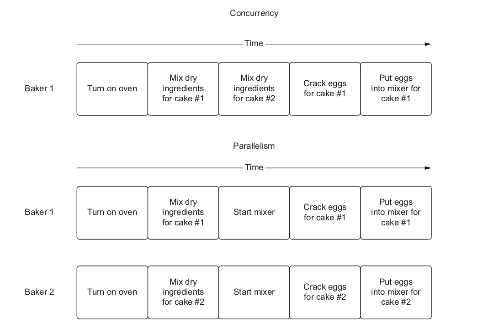
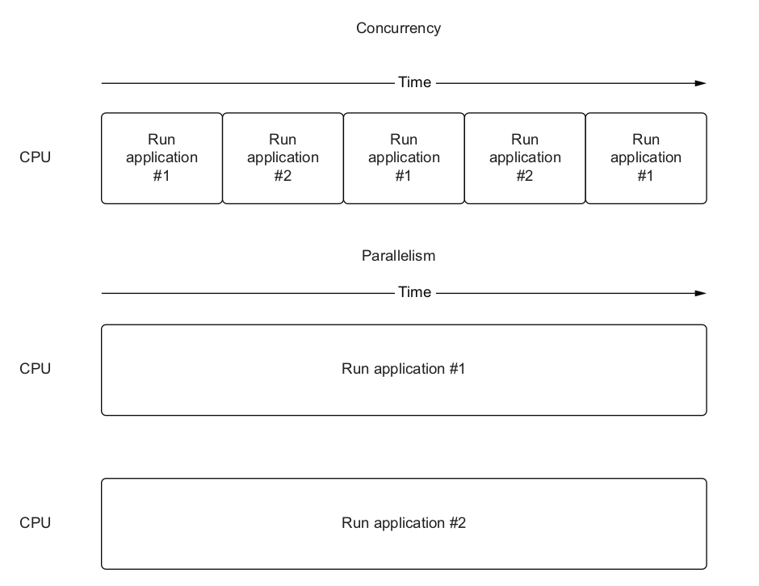
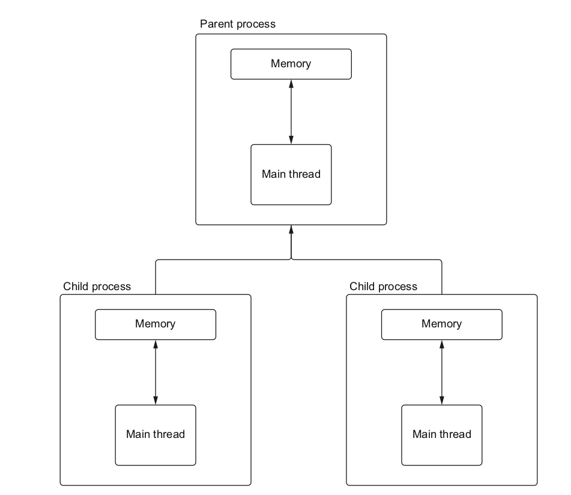
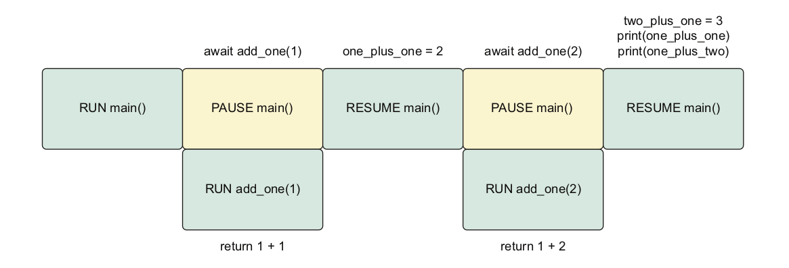
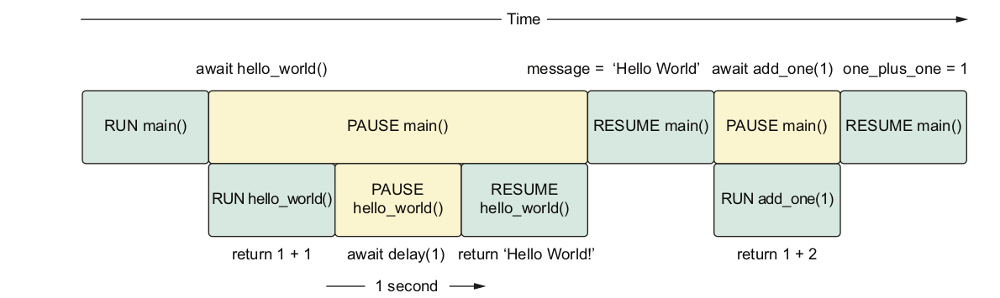
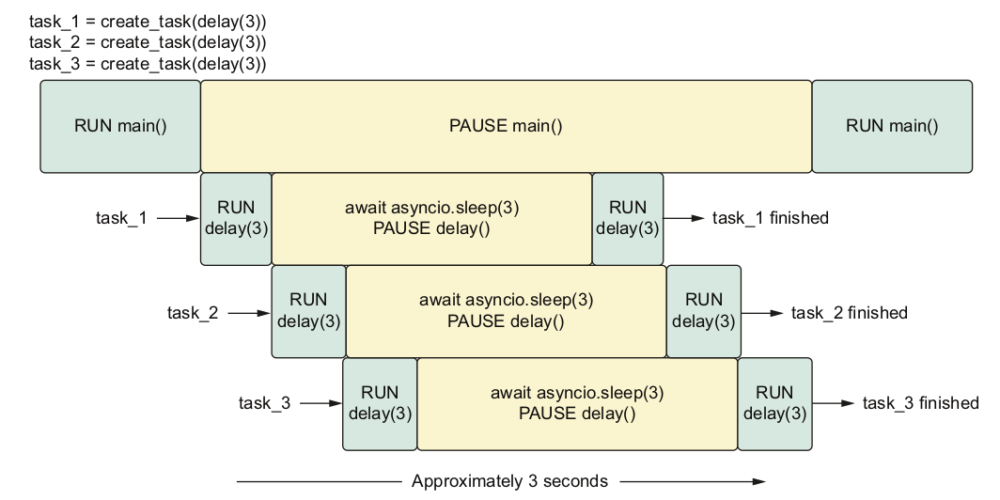
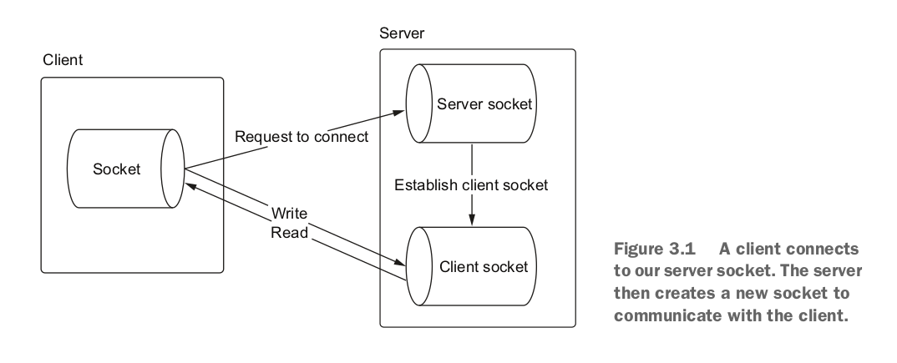

<div dir="rtl" style="font-size:60px; color:yellowgreen">
asyncio in python
</div>

<div dir="rtl" style="font-size:50px; color:orangered">
Chapter 1
</div>

<div dir="rtl" style="font-size:30px; color:orangered">
I/O Bound , Cpu Bound
</div>

<div dir="rtl" style="font-size:18px">
 به دو دسته عملیات در برنامه‌نویسی اشاره دارند که با توجه به ماهیتشان، رفتار متفاوتی دارند:

i/o bound (محدود به ورودی/خروجی):

عملیاتی که اکثر وقت اجرایشان صرف منتظر ماندن برای تکمیل ورودی/خروجی می‌شود.
مانند خواندن/نوشتن فایل، درخواست از پایگاه داده یا شبکه
با افزایش سرعت ورودی/خروجی زمان اجرا کمتر می‌شود

cpu bound (محدود به پردازنده):

عملیاتی که اکثر زمان اجراشان صرف محاسبات پیچیده می‌شود
مانند محاسبات ریاضی، پردازش تصویر، داده‌کاوی
با افزایش قدرت پردازشی سخت‌افزار، زمان کمتری نیاز دارند
با تشخیص اینکه عملیات‌ها محدود به چی هستند، می‌توان راه‌های بهینه اجرای هم‌روند را پیاده‌سازی کرد.
</div>

```python
import requests

response = requests.get('https:/ / www .example .com')  # I/O-bound web request

items = response.headers.items()
headers = [f'{key}: {header}' for key, header in items]  # CPU-bound response processing
formatted_headers = '\n'.join(headers)  # CPU-bound string concatenation

with open('headers.txt', 'w') as file:
    file.write(formatted_headers)  # I/O-bound write to disk
```

<div dir="rtl" style="font-size:30px; color:orangered">
Understanding concurrency, parallelism and multitasking
</div>

<div dir="rtl" style="font-size:18px">
هم‌روندی و موازی‌سازی دو مفهوم هستند که به ما کمک می‌کنند درک کنیم که برنامه‌نویسی چگونه وظایف، روش‌ها و روتین‌های مختلفی که محرک عمل هستند را زمان‌بندی و اجرا می‌کند.
</div>

<div dir="rtl" style="font-size:30px; color:orangered">
Concurrency
</div>


<div dir="rtl" style="font-size:18px">
وقتی می‌گوییم دو تسک به طور هم‌روند اتفاق می‌افتند، به این معناست که آن تسک‌ها به طور همزمان رخ می‌دهند. به عنوان مثال، یک نانوا که دو کیک متفاوت درست می‌کند. برای پختن این کیک‌ها، نیاز داریم تا ابتدا فر را گرم کنیم. گرم شدن فر ممکن است بسته به نوع فر و دمای پخت، چندین دقیقه طول بکشد، اما نیاز نیست تا زمانی که فر گرم شد منتظر بمانیم و شروع به انجام تسک‌های دیگر مثل مخلوط کردن آرد و شکر با تخم مرغ نکنیم. می‌توانیم تا زمانی که فر بوق بزند و به ما اطلاع دهد گرم شده است، کارهای دیگر انجام دهیم.
</div>

<div dir="rtl" style="font-size:18px">
ما همچنین نیاز نداریم که پیش از پایان کیک اول، شروع کار روی کیک دوم را محدود کنیم. می‌توانیم پخت یک کیک را شروع کنیم، آن را در یک مخلوط‌کن قرار دهیم و در حالی که پخت کیک اول در مخلوط‌کن در حال انجام است، شروع به آماده کردن پخت کیک دوم کنیم. در این مدل، ما به شکل هم‌روند بین وظایف مختلف جابجا می‌شویم. این جابجایی بین تسک‌ها (انجام کار دیگر در حالی که فر در حال گرم شدن است، جابجا شدن بین دو نوع پخت کیک) رفتاری هم‌روند است.
</div>

<div dir="rtl" style="font-size:30px; color:orangered">
Parallelism
</div>

<div dir="rtl" style="font-size:18px">
در حالی که هم‌روندی به این معناست که چندین تسک به طور همزمان در حال پردازش هستند، الزاماً به این معنا نیست که آن‌ها به طور موازی با هم اجرا می‌شوند. وقتی می‌گوییم چیزی به طور موازی در حال اجراست، نه تنها به این معناست که دو یا چند تسک به طور هم‌روند وجود دارند، بلکه آن‌ها هم‌زمان نیز در حال اجرا هستند. بازگشت به مثال پخت کیک، فرض کنید کمک یک نانوای دوم را داریم. در این سناریو، می‌توانیم روی کیک اول کار کنیم در حالی که نانوای دوم روی کیک دوم کار می‌کند. دو نفر که به طور همزمان در حال آماده‌سازی پخت هستند، موازی است زیرا دو تسک مجزا به طور هم‌روند در حال اجرا هستند.
</div>

</img>

<div dir="rtl" style="font-size:18px">
تصور کنید سیستم‌عامل دو برنامه اجرا می‌کند. در یک سیستم که فقط هم‌روند است، می‌توانیم بین اجرای این دو برنامه سوئیچ کنیم، ابتدا یکی از برنامه‌ها را برای مدت کوتاهی اجرا و سپس اجرا را به برنامه دوم واگذار می‌کنیم. اگر این سوئیچ بین برنامه‌ها به اندازه کافی سریع انجام شود، تصور دو رویداد همزمان به وجود می‌آید. در یک سیستم موازی، دو برنامه به طور همزمان در حال اجرا هستند و ما دو رویداد را به طور هم‌روند فعالانه در حال اجرا داریم.
</div>

</img>

<div dir="rtl" style="font-size:30px; color:orangered">
The difference between concurrency and parallelism
</div>

<div dir="rtl" style="font-size:18px">

هم‌روندی در مورد چند تسک است که می‌توانند به طور مستقل از یکدیگر رخ دهند. می‌توانیم هم‌روندی را روی یک CPU با فقط یک
هسته داشته باشیم، زیرا عملیات از چندوظیفه‌ای انتخابی (که در بخش بعد تعریف شده) برای سوئیچ بین تسک‌ها استفاده می‌کند.

اما موازی‌سازی به معنای اجرای دو یا چند تسک به طور همزمان است. روی یک ماشین با یک هسته پردازنده، این امکان‌پذیر نیست.
برای امکان‌پذیر شدن این کار، نیاز به یک CPU با چند هسته داریم که بتواند دو تسک را با هم اجرا کند.
</div>

<div dir="rtl" style="font-size:30px; color:orangered">
multitasking
</div>


<div dir="rtl" style="font-size:18px">
چندوظیفه‌ای امروزه در همه جا وجود دارد. هنگام صبحانه درست کردن، زمانی که در انتظار جوش آمدن آب برای دم کردن چای هستیم، تلفن را جواب می‌دهیم یا به پیام‌هایمان پاسخ می‌دهیم؛ مثال خوبی از چندوظیفه‌ای است. حتی هنگام رفت و آمد به محل کار، وقتی که در قطار هستیم نیز در حال چندوظیفه‌ای هستیم و کتاب می‌خوانیم تا به ایستگاه مقصد برسیم. دو نوع اصلی چندوظیفه‌ای در این بخش مورد بحث قرار می‌گیرد: چندوظیفه‌ای انتخابی و چندوظیفه‌ای همکارانه.
</div>

<div dir="rtl" style="font-size:18px">
1-  چندوظیفه‌ای انتخابی

در این مدل، اجازه می‌دهیم سیستم‌عامل تصمیم بگیرد چگونه بین کارهایی که در حال حاضر در حال اجرا هستند، با یک فرایند به نام
برش زمانی جابجا شود. وقتی سیستم‌عامل بین کارها جابجا می‌شود، ما آن را مصادره کردن می‌نامیم.

اینکه این سازوکار در زیر پوسته چگونه کار می‌کند بستگی به خود سیستم‌عامل دارد. این کار اصولاً با استفاده از ریسمان‌ها یا
فرایندهای متعدد انجام می‌شود.

2- چندوظیفه‌ای همکارانه

در این مدل، به جای اتکا به سیستم‌عامل برای تصمیم‌گیری در مورد زمان جابجایی بین کارهای در حال اجرا، ما به طور صریح نقاطی
را در برنامه خود کدنویسی می‌کنیم که می‌توانیم اجازه دهیم تسک‌های دیگر اجرا شوند. تسک‌ها در برنامه ما به طوری همکاری
می‌کنند که به طور صریح می‌گویند: "من برای مدتی تسک خودم را متوقف می‌کنم؛ پس بروید و تسک‌های دیگر را اجرا کنید."
</div>

<div dir="rtl" style="font-size:30px; color:orangered">
1.4-Understanding processes, threads, multithreading and multiprocessing
</div>

<div dir="rtl" style="font-size:30px; color:orangered">
1.4.1-Process
</div>

<div dir="rtl" style="font-size:18px">
ک فرآیند اجرایی، برنامه‌ای است که یک فضای حافظه دارد که برنامه‌های دیگر نمی‌توانند به آن دسترسی داشته باشند. مثالی از ایجاد یک فرآیند پایتون، اجرای یک برنامه ساده "سلام دنیا"
</div>

<div dir="rtl" style="font-size:30px; color:orangered">
1.4.2-Thread
</div>

<div dir="rtl" style="font-size:18px">
نخ‌ها به عنوان فرآیندهای سبک‌تر می‌توانند در نظر گرفته شوند. علاوه بر این، کوچک‌ترین ساختاری هستند که می‌تواند توسط یک سیستم عامل مدیریت شود. آن‌ها به عنوان یک فرآیند هم‌گام با فرآیندی که آن‌ها را ایجاد کرده‌اند، اشتراک دارند و حافظه مستقلی همچون یک فرآیند ندارند. نخ‌ها با فرآیندی که آن‌ها را ایجاد کرده‌اند مرتبط هستند. همیشه یک نخ حداقل با یک فرآیند مرتبط خواهد بود که معمولاً به عنوان نخ اصلی شناخته می‌شود. یک فرآیند همچنین می‌تواند سایر نخ‌ها را ایجاد کند که به عنوان نخ‌های کارگر یا پس‌زمینه معروف‌تر هستند. این نخ‌ها می‌توانند به صورت همزمان کنار نخ اصلی کارهای دیگری را انجام دهند. نخ‌ها، مانند فرآیندها، می‌توانند در کنار یکدیگر روی یک پردازنده چند هسته‌ای اجرا شوند و سیستم عامل نیز می‌تواند از طریق تایم اسلایسینگ بین آن‌ها جابجا شود. هنگامی که یک برنامه عادی پایتون اجرا می‌شود
</div>

```python
import os
import threading

print(f'Python process running with process id: {os.getpid()}')

total_threads = threading.active_count()
thread_name = threading.current_thread().name
print(f'Python is currently running {total_threads} thread(s)')
print(f'The current thread is {thread_name}')
```

<div dir="rtl" style="font-size:18px">
نحوه تعریف یک thread در پایتون:
</div>

```python
import threading


def hello_from_thread():
    print(f'Hello from thread {threading.current_thread()}!')


hello_thread = threading.Thread(target=hello_from_thread)
hello_thread.start()
total_threads = threading.active_count()
thread_name = threading.current_thread().name
print(f'Python is currently running {total_threads} thread(s)')
print(f'The current thread is {thread_name}')
hello_thread.join()
```

```
Hello from thread <Thread(Thread-1 (hello_from_thread), started 140468211693312)>!Python is currently running 2 thread(s)
The current thread is MainThread
```

<div dir="rtl" style="font-size:18px">
توجه داشته باشید که هنگام اجرای این کد، ممکن است ببینید که پیام‌های "hello from thread" و "Python is currently running 2 thread(s)" روی یک خط چاپ می‌شوند. این یک شرایط رخداد (race condition) است؛
</div>

<div dir="rtl" style="font-size:18px">
چندنخی تنها راهی برای دستیابی به همروندی نیست؛ می‌توانیم همچنین چندین فرآیند ایجاد کنیم تا به صورت همزمان کارهای ما انجام دهند. این به عنوان چندپردازش شناخته می‌شود. در چندپردازش، یک فرآیند اصلی یک یا چند فرآیند فرزند ایجاد می‌کند که توسط آن مدیریت می‌شود. سپس می‌تواند کار را به فرآیندهای فرزند توزیع کند.

چند پردازندگی فقط در صورتی باعث بهبود میشود که کار CPU Bound باشد.
</div>

```python
import multiprocessing
import os


def hello_from_process():
    print(f'Hello from child process {os.getpid()}!')


if __name__ == '__main__':
    hello_process = multiprocessing.Process(target=hello_from_process)
    hello_process.start()
    print(f'Hello from parent process {os.getpid()}')
    hello_process.join()
```

</img>

<div dir="rtl" style="font-size:30px; color:orangered">
1.5-Understanding the global interpreter lock
</div>

<div dir="rtl" style="font-size:18px">
GIL جلوگیری می‌کند که یک فرآیند پایتون بیش از یک دستور بایت کد پایتون را همزمان اجرا کند. این به این معناست که حتی اگر ما چندین نخ در یک ماشین با چندین هسته داشته باشیم، یک فرآیند پایتون تنها می‌تواند یک نخ را در هر زمان برای اجرای کد پایتون داشته باشد. در یک دنیایی که ما CPU‌ها با چندین هسته داریم، این می‌تواند چالش قابل توجهی برای توسعه‌دهندگان پایتون باشد که به دنبال بهره‌مندی از چندنخی برای بهبود عملکرد برنامه‌های خود هستند.
</div>

<div dir="rtl" style="font-size:18px">
توجه: چندپردازش می‌تواند چند دستور بایت کد را همزمان اجرا کند زیرا هر فرآیند پایتون دارای یک GIL خود است.
</div>


<div dir="rtl" style="font-size:18px">
پس چرا GIL وجود دارد؟ پاسخ در نحوه مدیریت حافظه در CPython قرار دارد. در CPython، حافظه اصولاً توسط یک فرآیند به نام refrence number مدیریت می‌شود. refrence number به این صورت کار می‌کند که مشخص می‌کند کدام کسی در حال حاضر به یک شیء خاص پایتونی نیاز دارد، مانند یک عدد صحیح، دیکشنری یا لیست. refrence number یک عدد صحیح است که تعداد مواردی که به آن شیء خاص مراجعه می‌کنند را نگاه می‌دارد. وقتی کسی دیگر به آن شیء مراجعه ندارد، refrence number کاهش می‌یابد، و وقتی کسی دیگر به آن نیاز دارد، افزایش می‌یابد. وقتی که refrence number به صفر می‌رسد، هیچ‌کس به آن شیء ارجاع نمی‌دهد و می‌تواند از حافظه حذف شود.
</div>

<div dir="rtl" style="font-size:18px">
:مثلا
</div>

```python
import time


def print_fib(number: int) -> None:
    def fib(n: int) -> int:
        if n == 1:
            return 0
        elif n == 2:
            return 1
        else:
            return fib(n - 1) + fib(n - 2)

    print(f'fib({number}) is {fib(number)}')


def fibs_no_threading():
    print_fib(40)
    print_fib(41)


start = time.time()
fibs_no_threading()
end = time.time()
a = end - start
print(f'Completed in {a:.4f} seconds.')

```

<div dir="rtl" style="font-size:18px">
کد بالا بدون استفاده از نخ نوشته شده و خروجی به این شکل است:
</div>

```
fib(40) is 63245986
fib(41) is 102334155
Completed in 27.5834 seconds.
```

<div dir="rtl" style="font-size:18px">
حالا با استفاده از نخ این تابع رو بازنویسی میکنیم:
</div>

```python
import threading
import time


def print_fib(number: int) -> None:
    def fib(n: int) -> int:
        if n == 1:
            return 0
        elif n == 2:
            return 1
        else:
            return fib(n - 1) + fib(n - 2)

    print(f'fib({number}) is {fib(number)}')


def fibs_with_threads():
    fortieth_thread = threading.Thread(target=print_fib, args=(40,))
    forty_first_thread = threading.Thread(target=print_fib, args=(41,))

    fortieth_thread.start()
    forty_first_thread.start()
    fortieth_thread.join()
    forty_first_thread.join()


start_threads = time.time()
fibs_with_threads()
end_threads = time.time()
print(f'Threads took {end_threads - start_threads:.4f} seconds.')

```

<div dir="rtl" style="font-size:18px">
که خروجی میشه این:
</div>

```
fib(40) is 63245986
fib(41) is 102334155
Threads took 28.2851 seconds.
```

<div dir="rtl" style="font-size:18px">
استفاده از نخ حتی زمان رو بیشتر کرد این همون کار GIL هست که چون متغیر مشترک در هردو نخ وجود داره نمیزاره تا زمانی که کار نخ اول تموم نشده نخ دوم اجرا بشه و نخ دوم باید منتظر بمونه تا کار نخ اول تموم بشه همین باعث میشه زمانش بیشتر بشه. اگرچه درست است که نخ‌ها به صورت همزمان اجرا می‌شوند، اما به دلیل قفل، فقط یکی از آن‌ها مجاز به اجرای کد پایتون در یک زمان است. این باعث می‌شود نخ دیگر در حالت انتظار قرار گیرد تا نخ اول کار خود را به پایان برساند که به طور کامل ارزش چند نخ را نابود می‌کند.
</div>

<div dir="rtl" style="font-size:30px; color:orangered">
1.5.1-Is the GIL ever released?
</div>

<div dir="rtl" style="font-size:18px">
قفل مفسر جهانی زمانی آزاد می‌شود که عملیات I/O رخ دهد. این به ما امکان می‌دهد تا از نخ‌ها برای انجام کارهای همزمان در زمینه I/O استفاده کنیم
</div>

```python
import time
import requests


def read_example() -> None:
    response = requests.get('https:/ / www .example .com')
    print(response.status_code)


sync_start = time.time()
read_example()
read_example()
sync_end = time.time()
print(f'Running synchronously took {sync_end - sync_start:.4f} seconds.')
```

```
200
200
Running synchronously took 0.2306 seconds.
```

<div dir="rtl" style="font-size:18px">
حالا با نخ کد رو مینویسیم:
</div>

```python
import time
import threading
import requests


def read_example() -> None:
    response = requests.get('https:/ / www .example .com')
    print(response.status_code)


thread_1 = threading.Thread(target=read_example)
thread_2 = threading.Thread(target=read_example)
thread_start = time.time()
thread_1.start()
thread_2.start()
print('All threads running!')
thread_1.join()
thread_2.join()
thread_end = time.time()
print(f'Running with threads took {thread_end - thread_start:.4f} seconds.')
```

```
All threads running!
200
200
Running with threads took 0.0977 seconds.
```

<div dir="rtl" style="font-size:18px">
این تقریباً دو برابر سریعتر از نسخه اصلی ما است که از نخ‌ها استفاده نمی‌کرد، زیرا دو درخواست را در تقریباً همان زمان اجرا کرده‌ایم! البته، به تبع اتصال اینترنت و مشخصات ماشین شما، نتایج مختلفی خواهید دید، اما اعداد به طور جهت‌گیری مشابه خواهند بود.
پس چگونه امکان دارد که GIL را برای I/O آزاد کنیم اما برای عملیات CPU-bound نه؟ پاسخ در سیگنال‌های سیستمی است که به صورت پشت‌پرده ارسال می‌شوند. در مورد I/O، سیگنال‌های سیستمی سطح پایین خارج از زمان اجرای پایتون هستند. این امکان را فراهم می‌کند تا GIL آزاد شود زیرا به صورت مستقیم با اشیاء پایتون تعامل ندارد. در این حالت، GIL فقط در زمانی که داده دریافت شده به یک شیء پایتون تبدیل می‌شود، مجدداً به دست می‌آید. سپس در سطح سیستم عامل، عملیات I/O به صورت همزمان اجرا می‌شود. این مدل به ما همروندی می‌دهد اما هم‌زمانی را نه. در زبان‌های دیگر مانند جاوا یا C++، ما در ماشین‌های چند هسته‌ای هم‌زمانی واقعی داریم چون GIL نداریم و می‌توانیم به صورت همزمان اجرا کنیم. اما در پایتون به دلیل وجود GIL، بهترین کاری که می‌توانیم انجام دهیم همان همروندی عملیات I/O است و تنها یک قطعه کد پایتون در هر لحظه اجرا می‌شود.
</div>

<div dir="rtl" style="font-size:18px">
در واقع، وقتی یک نخ در حال انجام یک عملیات I/O است و سیگنال مربوطه را دریافت می‌کند، GIL آزاد می‌شود تا نخ دیگری بتواند در همان زمان اجرا شود. این امکان به پایتون اجازه می‌دهد که به طور همزمان عملیات‌های I/O را انجام دهد و در حین انتظار برای داده‌ها یا اتمام I/O، نخ‌های دیگر نیز بتوانند اجرای خود را ادامه دهند.
</div>

<div dir="rtl" style="font-size:30px; color:orangered">
1.5.2-asyncio and the GIL
</div>

<div dir="rtl" style="font-size:18px">
به این معنی که یک thread می تواند در حالی که I/O انجام می شود، به کار دیگری ادامه دهد. async این امکان را می دهد که چندین کار I/O به طور همزمان انجام شود.
</div>

<div dir="rtl" style="font-size:50px; color:orangered">
Chapter 2
</div>

<div dir="rtl" style="font-size:30px; color:orangered">
2.1-Introducing coroutines
</div>

<div dir="rtl" style="font-size:18px">
یک کراتین را مانند یک تابع معمولی در پایتون تصور کنید، با این تفاوت که این تابع توانایی توقف اجرای خود را دارد زمانی که با یک عملیات ممکن است مدتی طول بکشد برای اتمام. 
</div>

<div dir="rtl" style="font-size:30px; color:orangered">
2.1.1-Creating coroutines with the async keyword
</div>

<div dir="rtl" style="font-size:18px">
نحوه ایجاد کروتین(Coroutine):
</div>

```python
async def my_coroutine() -> None:
    print("Hello world!")
```

<div dir="rtl" style="font-size:18px">
این دستورات ساده است، اما ما چیزی کاملاً متفاوت از یک تابع معمولی پایتون ایجاد می‌کنیم. به عنوان مثال: 
</div>

```python
async def coroutine_add_one(number: int) -> int:
    return number + 1


def add_one(number: int) -> int:
    return number + 1


function_result = add_one(1)
coroutine_result = coroutine_add_one(1)
print(f'Function result is {function_result} and the type is {type(function_result)}')
print(f'Coroutine result is {coroutine_result} and the type is {type(coroutine_result)}')

```

```
# result
Function result is 2 and the type is <class 'int'>
Coroutine result is <coroutine object coroutine_add_one at 0x7fc02ec56800> and the type is <class 'coroutine'>
```

<div dir="rtl" style="font-size:18px">
 توجه داشته باشید که هنگامی که تابع عادی add_one را فراخوانی می‌کنیم، فوراً اجرا شده و نتیجه انتظاری یعنی یک عدد صحیح به ما برمی‌گرداند. با این حال، هنگامی که coroutine_add_one را فراخوانی می‌کنیم، کد در کوروتین به هیچ وجه اجرا نمی‌شود. به جای اینکه کد کوروتین را مستقیماً فراخوانی کنیم، یک شیء کوروتین دریافت می‌کنیم.برای اجرا باید از کتابخونه `asyncio` استفاده کنیم
</div>

```python
import asyncio


async def coroutine_add_one(number: int) -> int:
    return number + 1


result = asyncio.run(coroutine_add_one(1))
print(result)
```

<div dir="rtl" style="font-size:30px; color:orangered">
2.1.2-Pausing execution with the await keyword
</div>

<div dir="rtl" style="font-size:18px">
مزیت واقعی asyncio این است که می‌توانیم اجرا را به وقفه بیاندازیم تا حلقه رویداد از اجرای سایر وظایف در طول یک عملیات طولانی استفاده کند. برای وقفه اجرا، از کلمه کلید await استفاده می‌کنیم. 
</div>

<div dir="rtl" style="font-size:18px">
استفاده از کلمه کلید await باعث اجرای کوروتین پس از آن می‌شود، برخلاف فراخوانی مستقیم یک کوروتین که یک شیء کوروتین تولید می‌کند. عبارت await همچنین کوروتین را که در آن قرار دارد تا زمانی که کوروتینی که منتظر آن بودیم پایان می‌یابد و یک نتیجه باز می‌گرداند، متوقف خواهد کرد. هنگامی که کوروتینی که منتظر آن بودیم پایان می‌یابد، به نتیجه‌ای که باز گردانده شده دسترسی خواهیم داشت و کوروتین محتوی نیز "بیدار" می‌شود تا نتیجه را پردازش کند.
</div>

```python
import asyncio


async def add_one(number: int) -> int:
    return number + 1


async def main() -> None:
    one_plus_one = await add_one(1)
    two_plus_one = await add_one(2)
    print(one_plus_one)
    print(two_plus_one)


asyncio.run(main())

```

<div dir="rtl" style="font-size:18px">
تو این شکل کامل نشون داده میشه:
</div>

</img>

<div dir="rtl" style="font-size:18px">
اول تابع main اجرا میشه که در اون یک await هست تابع اصلی متوقف میشه و تابع add_one(1) اجرا میشه بعد تموم شدن و برگرداندن نتیجه تابع اصلی اجرا میشه و await بعدی اجرا میشه  و تابع اصلی متوقف میشه.

</div>


<div dir="rtl" style="font-size:18px">
پس چه فرقی داره این روش دقیقا مثل وقتی هست که ما داریم sync مینویسیم.
</div>

<div dir="rtl" style="font-size:30px; color:orangered">
2.2-Introducing long-running coroutines with sleep
</div>

```python
import asyncio


async def delay(delay_seconds: int) -> int:
    print(f'sleeping for {delay_seconds} second(s)')
    await asyncio.sleep(delay_seconds)
    print(f'finished sleeping for {delay_seconds} second(s)')
    return delay_seconds


async def add_one(number: int) -> int:
    return number + 1


async def hello_world_message() -> str:
    await delay(1)
    return "Hello World!"


async def main() -> None:
    message = await hello_world_message()
    one_plus_one = await add_one(1)
    print(one_plus_one)
    print(message)


asyncio.run(main())

```

```
# output
sleeping for 1 second(s)
finished sleeping for 1 second(s)
2
Hello World!
```

<div dir="rtl" style="font-size:18px">
هنگامی که این را اجرا می‌کنیم، 1 ثانیه می‌گذرد تا نتایج هر دو فراخوانی تابع چاپ شوند. آنچه ما واقعاً می‌خواهیم این است که مقدار add_one(1) فوراً چاپ شود در حالی که hello_world_message() همزمان اجرا می‌شود. پس چرا این اتفاق با این کد رخ نمی‌دهد؟ جواب این است که await اجرای کوروتین فعلی را متوقف می‌کند و هیچ کد دیگری درون همان کوروتین اجرا نمی‌شود تا زمانی که عبارت await ما یک مقدار به ما بدهد. از آنجایی که زمانی که تابع hello_world_message به ما یک مقدار بدهد، 1 ثانیه طول خواهد کشید، کوروتین اصلی به مدت 1 ثانیه متوقف خواهد شد.
</div>

</img>

<div dir="rtl" style="font-size:18px">
برای درست اجرا شدن باید کارهای دیگری انجام دهیم:!!!!
</div>

<div dir="rtl" style="font-size:30px; color:orangered">
2.3-Running concurrently with tasks
</div>

<div dir="rtl" style="font-size:18px">
با استفاده از این ابزارها (async, await) تنها می‌توانیم کد ناهمزمان بنویسیم، اما هیچ چیز را همزمان اجرا نمی‌کنیم. برای اجرای همزمان کوروتین‌ها، باید به مفاهیمی به نام "tasks" معرفی کنیم.
</div>

<div dir="rtl" style="font-size:18px">
با استفاده از این ابزارها (async, await) تنها می‌توانیم کد ناهمزمان بنویسیم، اما هیچ چیز را همزمان اجرا نمی‌کنیم. برای اجرای همزمان کوروتین‌ها، باید به مفاهیمی به نام "tasks" معرفی کنیم.
</div>


<div dir="rtl" style="font-size:30px; color:orangered">
2.3.1-The basics of creating tasks
</div>

<div dir="rtl" style="font-size:18px">
ایجاد یک تسک با استفاده از تابع asyncio.create_task امکان‌پذیر است. هنگامی که این تابع را فراخوانی می‌کنیم، یک کوروتین را به آن می‌دهیم و فوراً یک شیء تسک دریافت می‌کنیم. یک بار که یک شیء تسک داریم، می‌توانیم آن را در یک عبارت await قرار دهیم تا مقدار بازگشتی را در زمان کامل شدن آن استخراج کنیم.
</div>

```python
import asyncio
import time


async def another_message() -> str:
    print("Hello world11111111111111111!")
    await asyncio.sleep(2)
    print("Hello World 22222222222222222!")
    return "Hello World 22222222222222222!"


async def hello_world_message() -> str:
    print("Hello World33333333333333333")
    await asyncio.sleep(5)
    print("Hello World444444444444444444!")
    return "Hello World444444444444444444!"


async def main() -> None:
    a = time.time()
    r1 = asyncio.create_task(hello_world_message())
    r2 = asyncio.create_task(another_message())

    r3 = await r1
    r4 = await r2

    b = time.time() - a
    print(b)
    print(r3)
    print(r4)
```

```
Hello World33333333333333333
Hello world11111111111111111!
Hello World 22222222222222222!
Hello World444444444444444444!
5.004255056381226
Hello World444444444444444444!
Hello World 22222222222222222!
```

<div dir="rtl" style="font-size:18px">
در حالت عادی این کد ۷ ثانیه باید طول بکشه ولی با async حدود ۵ ثانیه طول کشیده
</div>

<div dir="rtl" style="font-size:30px; color:orangered">
2.3.2-Running multiple tasks concurrently
</div>

<div dir="rtl" style="font-size:18px">
از آنجایی که تسک‌ها به سرعت ایجاد می‌شوند و برنامه جداگانه برنامه‌ریزی می‌شوند تا در اسرع وقت اجرا شوند، این امکان را فراهم می‌کند که ما بتوانیم به صورت همزمان بسیاری از وظایف بلند مدت را اجرا کنیم.
</div>

```python
import asyncio


async def delay(delay_seconds: int) -> int:
    print(f'sleeping for {delay_seconds} second(s)')
    await asyncio.sleep(delay_seconds)
    print(f'finished sleeping for {delay_seconds} second(s)')
    return delay_seconds


async def main():
    sleep_for_three = asyncio.create_task(delay(3))
    sleep_again = asyncio.create_task(delay(3))
    sleep_once_more = asyncio.create_task(delay(3))
    await sleep_for_three
    await sleep_again
    await sleep_once_more


asyncio.run(main())
```

<div dir="rtl" style="font-size:18px">
دقیقا مثل آخرین مثال 2.3.1. کد در تسک‌های مشخص شده به RUN delay(3) (در این حالت، برخی از اظهارات چاپ) به صورت همزمان با تسک‌های دیگر اجرا نمی‌شود؛ تنها روند خواب همزمان اجرا می‌شود. اگر این عملیات‌های تاخیر را به ترتیب اجرا می‌کردیم، زمان اجرای برنامه بیش از 9 ثانیه می‌شد. با اجرای همزمان این کار، ما زمان اجرای کل این برنامه را سه برابر کاهش داده‌ایم!
</div>

</img>

<div dir="rtl" style="font-size:30px; color:orangered">
2.4.1-Canceling tasks
</div>

<div dir="rtl" style="font-size:18px">
 اگر به یک کاربر اجازه دهیم یک درخواستی ارسال کند که طول زیادی طول بکشد، احتمالاً برای همیشه منتظر پاسخ نخواهد ماند. علاوه بر این، ممکن است بخواهیم به کاربران امکان دهیم چاره‌ای پیدا کنند اگر یک وظیفه به طور مداوم اجرا شود. کاربر ممکن است به طور فعال فهمیده باشد که مسائل زیادی طول کشیده‌اند یا بخواهند یک وظیفه‌ای که به اشتباه ایجاد کرده‌اند را متوقف کنند.
</div>

```python
import asyncio
from asyncio import CancelledError


async def delay(delay_seconds: int) -> int:
    print(f'sleeping for {delay_seconds} second(s)')
    await asyncio.sleep(delay_seconds)
    print(f'finished sleeping for {delay_seconds} second(s)')
    return delay_seconds


async def main():
    long_task = asyncio.create_task(delay(100))
    seconds_elapsed = 0
    while not long_task.done():
        print('Task not finished, checking again in a second.')
        await asyncio.sleep(1)
        seconds_elapsed = seconds_elapsed + 1
        if seconds_elapsed == 5:
            long_task.cancel()
    try:
        await long_task
    except CancelledError:
        print('Our task was cancelled')


asyncio.run(main())
```

```
# output

Task not finished, checking again in a second.
sleeping for 100 second(s)
Task not finished, checking again in a second.
Task not finished, checking again in a second.
Task not finished, checking again in a second.
Task not finished, checking again in a second.
Task not finished, checking again in a second.
Our task was cancelled
```

<div dir="rtl" style="font-size:18px">
نکته مهمی که باید در مورد لغو توجه داشته باشیم این است که یک CancelledError فقط می‌تواند از یک عبارت await پرتاب شود. این به این معناست که اگر ما در حالت اجرای کد پایتون ساده cancel را در یک وظیفه فراخوانی کنیم، کد تا تکمیل اجرا می‌شود تا به نقطه await برسد (اگر وجود داشته باشد) و یک CancelledError ممکن است پرتاب شود. فراخوانی cancel نمی‌تواند به طور جادویی اجرای وظیفه را متوقف کند؛ فقط زمانی وظیفه را متوقف می‌کند که در حال حاضر در یک نقطه await یا نقطه await بعدی آن قرار دارید.
</div>

<div dir="rtl" style="font-size:30px; color:orangered">
2.4.2-Setting a timeout and canceling with wait_for
</div>

<div dir="rtl" style="font-size:18px">
ماژول asyncio این قابلیت را از طریق تابعی به نام asyncio.wait_for فراهم کرده است. این تابع یک coroutine یا شیء وظیفه را و یک مقدار زمان تعیین‌شده به صورت ثانیه‌ای دریافت می‌کند. سپس یک coroutine را برمی‌گرداند که ما می‌توانیم منتظر آن شویم. اگر وظیفه بیشتر از زمان تعیین‌شده برای انجام نیاز داشته باشد، یک استثناء TimeoutException پرتاب می‌شود. هنگامی که به آستانه زمان انتظار برسیم، وظیفه به طور خودکار لغو می‌شود.
</div>

```python
import asyncio


async def delay(delay_seconds: int) -> int:
    print(f'sleeping for {delay_seconds} second(s)')
    await asyncio.sleep(delay_seconds)
    print(f'finished sleeping for {delay_seconds} second(s)')
    return delay_seconds


async def main():
    delay_task = asyncio.create_task(delay(2))
    try:
        result = await asyncio.wait_for(delay_task, timeout=1)
        print(result)
    except asyncio.exceptions.TimeoutError:
        print('Got a timeout!')
        print(f'Was the task cancelled? {delay_task.cancelled()}')


asyncio.run(main())
```

```
# output

sleeping for 2 second(s)
Got a timeout!
Was the task cancelled? True
```

<div dir="rtl" style="font-size:18px">
 با این حال، در شرایط خاصی ممکن است بخواهیم coroutine خود را ادامه دهیم. به عنوان مثال، ممکن است بخواهیم به کاربر اطلاع دهیم که چیزی بیشتر از انتظار زمانی طول می‌کشد، اما وظیفه را در صورت گذشت زمان مقرر لغو نکنیم.
</div>

```python
import asyncio


async def delay(delay_seconds: int) -> int:
    print(f'sleeping for {delay_seconds} second(s)')
    await asyncio.sleep(delay_seconds)
    print(f'finished sleeping for {delay_seconds} second(s)')
    return delay_seconds


async def main():
    task = asyncio.create_task(delay(10))
    try:
        result = await asyncio.wait_for(asyncio.shield(task), 5)
        print(result)
    except TimeoutError:
        print("Task took longer than five seconds, it will finish soon!")
    result = await task
    print(result)


asyncio.run(main())
```

```
# output

sleeping for 10 second(s)
Task took longer than five seconds, it will finish soon!
finished sleeping for 10 second(s)
10
```

<div dir="rtl" style="font-size:30px; color:orangered">
2.5.1-Introducing futures
</div>

<div dir="rtl" style="font-size:18px">
یک شیء در زبان برنامه‌نویسی پایتون است که یک مقدار واحد دارد که انتظار دارید در آینده دریافت کنید، اما ممکن است هنوز دسترسی به آن نداشته باشید. به طور معمول، هنگامی که یک آینده ایجاد می‌کنید، هیچ مقداری ندارد که اطراف آن باشد زیرا هنوز وجود ندارد.
</div>

```python
from asyncio import Future

my_future = Future()
print(f'Is my_future done? {my_future.done()}')
my_future.set_result(42)
print(f'Is my_future done? {my_future.done()}')
print(f'What is the result of my_future? {my_future.result()}')
```

```
# output

Is my_future done? False
Is my_future done? True
What is the result of my_future? 42
```

<div dir="rtl" style="font-size:30px; color:orangered">
2.6-Measuring coroutine execution time with decorators
</div>

<div dir="rtl" style="font-size:18px">
تا اینجا، ما درباره مدت زمان اجرای برنامه‌هایمان صحبت کرده‌ایم بدون اندازه‌گیری آنها. برای واقعیت درک و پروفایل کردن چیزها، نیاز به معرفی کدی داریم که برای ما این اطلاعات را نگه دارد.
</div>

```python
import asyncio
import functools
import time
from typing import Callable, Any


def async_timed():
    def wrapper(func: Callable) -> Callable:
        @functools.wraps(func)
        async def wrapped(*args, **kwargs) -> Any:
            print(f'starting {func} with args {args} {kwargs}')
            start = time.time()
            try:
                return await func(*args, **kwargs)
            finally:
                end = time.time()
                total = end - start
                print(f'finished {func} in {total:.4f} second(s)')

        return wrapped

    return wrapper


@async_timed()
async def delay(delay_seconds: int) -> int:
    print(f'sleeping for {delay_seconds} second(s)')
    await asyncio.sleep(delay_seconds)
    print(f'finished sleeping for {delay_seconds} second(s)')
    return delay_seconds


@async_timed()
async def main():
    task_one = asyncio.create_task(delay(2))
    task_two = asyncio.create_task(delay(3))
    await task_one
    await task_two


asyncio.run(main())
```

```
# output

starting <function main at 0x7ff06455a200> with args () {}
starting <function delay at 0x7ff064e06c00> with args (2,) {}
sleeping for 2 second(s)
starting <function delay at 0x7ff064e06c00> with args (3,) {}
sleeping for 3 second(s)
finished sleeping for 2 second(s)
finished <function delay at 0x7ff064e06c00> in 2.0024 second(s)
finished sleeping for 3 second(s)
finished <function delay at 0x7ff064e06c00> in 3.0017 second(s)
finished <function main at 0x7ff06455a200> in 3.0018 second(s)
```


<div dir="rtl" style="font-size:50px; color:orangered">
Chapter 3
</div>

<div dir="rtl" style="font-size:30px; color:orangered">
3.1-Working with blocking sockets
</div>

<div dir="rtl" style="font-size:18px">
این فصل راجب کار با سوکت در پایتون بحث میکنه.
</div>

<div dir="rtl" style="font-size:18px">
برای شروع، ما سوکت اصلی صندوق پستی را ایجاد می کنیم، که آن را سوکت سرور خود می نامیم. این سوکت ابتدا پیام های اتصال از کلاینت هایی را که می خواهند با ما ارتباط برقرار کنند قبول می کند. هنگامی که این اتصال توسط سوکت سرور ما تأیید شد، سوکتی ایجاد خواهیم کرد که می توانیم برای ارتباط با مشتری از آن استفاده کنیم. این بدان معناست که سرور ما شروع به شباهت بیشتر به یک اداره پست با چندین صندوق پستی به جای یک صندوق پستی می کند. سمت مشتری همچنان می تواند به عنوان داشتن یک صندوق پستی واحد تصور شود زیرا آنها فقط یک سوکت برای ارتباط با ما خواهند داشت. هنگامی که یک مشتری به سرور ما متصل می شود، به آنها یک صندوق پستی ارائه می دهیم. سپس از آن صندوق پستی برای ارسال و دریافت پیام ها به آن مشتری استفاده می کنیم 
</div>

</img>

<div dir="rtl" style="font-size:18px">
که در کد به این صورت میشه:
</div>

```python
import socket

# server socket
server_socket = socket.socket(socket.AF_INET, socket.SOCK_STREAM)
server_socket.setsockopt(socket.SOL_SOCKET, socket.SO_REUSEADDR, 1)
server_address = ('127.0.0.1', 8000)
server_socket.bind(server_address)
server_socket.listen()

# client socket
connection, client_address = server_socket.accept()
print(f'I got a connection from {client_address}!')
```

<div dir="rtl" style="font-size:30px; color:orangered">
3.2-Connecting to a server with Telnet
</div>

<div dir="rtl" style="font-size:30px; color:orangered">
3.2.1-Reading and writing data to and from a socket
</div>

<div dir="rtl" style="font-size:18px">
سوکت دارای یک متد به نام recv است که می توانیم از آن برای دریافت داده از یک سوکت خاص استفاده کنیم. این متد یک عدد صحیح را در نظر می گیرد که نشان دهنده تعداد بایت هایی است که می خواهیم در یک زمان خاص بخوانیم. این مهم است زیرا ما نمی توانیم تمام داده ها را از یک سوکت به طور کامل بخوانیم، ما باید تا زمانی که به انتهای ورودی برسیم، بافر کنیم.
</div>

```python
import socket
server_socket = socket.socket(socket.AF_INET, socket.SOCK_STREAM)
server_socket.setsockopt(socket.SOL_SOCKET, socket.SO_REUSEADDR, 1)
server_address = ('127.0.0.1', 8000)
server_socket.bind(server_address)
server_socket.listen()

try:
    connection, client_address = server_socket.accept()
    print(f'I got a connection from {client_address}!')
    buffer = b''
    while buffer[-2:] != b'\r\n':
        data = connection.recv(2)
        if not data:
            break
        else:
            print(f'I got data: {data}!')
        buffer = buffer + data
    print(f"All the data is: {buffer}")
    connection.sendall(buffer)
finally:
    server_socket.close()
```

```
I got a connection from ('127.0.0.1', 60036)!
I got data: b'ii'!
I got data: b'ii'!
I got data: b'ii'!
I got data: b'ii'!
I got data: b'ii'!
I got data: b'ii'!
I got data: b'ii'!
I got data: b'ii'!
I got data: b'\t\r'!
I got data: b'\n'!
All the data is: b'iiiiiiiiiiiiiiii\t\r\n'
```

<div dir="rtl" style="font-size:30px; color:orangered">
3.3-Working with non-blocking sockets
</div>

<div dir="rtl" style="font-size:18px">
متد recv یک متد مسدود کننده هست و نمیتوان به تنهایی با کد بالا چند تا کاربر به سرور متصل بشن. برای حل این مشکل باید از  این روش استفاده کنیم:
</div>

```python
import socket

server_socket = socket.socket(socket.AF_INET, socket.SOCK_STREAM)
server_socket.setsockopt(socket.SOL_SOCKET, socket.SO_REUSEADDR, 1)
server_address = ('127.0.0.1', 8000)
server_socket.bind(server_address)
server_socket.listen()
server_socket.setblocking(False)

connections = []
try:
    while True:
        try:
            connection, client_address = server_socket.accept()
            connection.setblocking(False)
            print(f'I got a connection from {client_address}!')
            connections.append(connection)
        except BlockingIOError:
            pass
        for connection in connections:
            try:
                buffer = b''
                while buffer[-2:] != b'\r\n':
                    data = connection.recv(2)
                    if not data:
                        break
                    else:
                        print(f'I got data: {data}!')
                    buffer = buffer + data
                print(f"All the data is: {buffer}")
            except BlockingIOError:
                pass
finally:
    server_socket.close()

```

<div dir="rtl" style="font-size:18px">
در کد بالا از setblocking استفاده کردیم تا توابع مسدود کننده از کار بیفتند. ولی با اینکار وقتی پیامی نباشه برنامه خطا میده پس مجبور شدیم try-except بزاریم تا برنامه خطا نده که این بده
</div>

<div dir="rtl" style="font-size:18px">
در ضمن با telnet به برنامه رکوئست میزنم:
telnet localhost 8000
</div>

<div dir="rtl" style="font-size:18px">
استفاده از این روش باعث استفاده 100 درصدی از CPU میشود که بهینه نیست.
</div>

<div dir="rtl" style="font-size:30px; color:orangered">
3.4-Using the selectors module to build a socket event loop
</div>

<div dir="rtl" style="font-size:18px">
یک کتابخونه وجود دارد که وقتی connection یک ایونت بفرستد در اون صورت به ما اطلاع میدهد و میتوانیم مقدار اون ایونت رو بگیریم. چون در سطح سخت افزاری اکثر کارها را انجام میدهد نیاز کمی به CPU داره.
</div>

```python
import selectors
import socket
from selectors import SelectorKey
from typing import List, Tuple

selector = selectors.DefaultSelector()
server_socket = socket.socket()
server_socket.setsockopt(socket.SOL_SOCKET, socket.SO_REUSEADDR, 1)
server_address = ('127.0.0.1', 8000)
server_socket.setblocking(False)
server_socket.bind(server_address)
server_socket.listen()
selector.register(server_socket, selectors.EVENT_READ)

while True:
    events: List[Tuple[SelectorKey, int]] = selector.select(timeout=1)
    if len(events) == 0:
        print('No events, waiting a bit more!')

    for event, _ in events:
        event_socket = event.fileobj

        if event_socket == server_socket:
            connection, address = server_socket.accept()
            connection.setblocking(False)
            print(f"I got a connection from {address}")
            selector.register(connection, selectors.EVENT_READ)
        else:
            data = event_socket.recv(1024)
            print(f"I got some data: {data}")
            event_socket.send(data)
```

<div dir="rtl" style="font-size:18px">
هدف این کتاب از آموزش سوکت اینه که asyncio از سوکت استفاده میکنه. یعنی با سوکت میفهمه که چه تسک هایی رو باید اجرا کنه و چه تسک هایی بهش پاس داده شده
</div>


<div dir="rtl" style="font-size:50px; color:orangered">
Chapter 4
</div>

<div dir="rtl" style="font-size:30px; color:orangered">
4.1-Introducing aiohttp
</div>


<div dir="rtl" style="font-size:18px">
یکی از کتابخانه های محبوب برای ایجاد درخواست های وب کتابخانه requests است. این کتابخانه با asyncio به خوبی کار نمی کند زیرا از سوکت های مسدود کننده استفاده می کند. این بدان معناست که اگر درخواستی انجام دهیم، رشته ای که در آن اجرا می شود مسدود می شود و از آنجایی که asyncio تک رشته است، حلقه رویداد ما به طور کامل تا زمانی که آن درخواست به پایان برسد متوقف می شود.
برای حل این مشکل و دستیابی به همزمانی، باید از کتابخانه ای استفاده کنیم که از طریق لایه سوکت تا پایین غیر مسدود باشد. 
</div>


<div dir="rtl" style="font-size:30px; color:orangered">
4.2-Asynchronous context managers
</div>


<div dir="rtl" style="font-size:18px">
در حالت sync برای کارهای io میتونیم از with استفاده کنیم:
</div>

```python
with open(‘example.txt’) as file:
    lines = file.readlines()
```

<div dir="rtl" style="font-size:18px">
اما این روش برای وقتی که از async استفاده میکنیم مناسب نیست برای اینکار پایتون یک سری مجیک متد طراحی کرده که باید اون هارو overide کنم:
</div>


```python
import asyncio
import socket
from types import TracebackType
from typing import Optional, Type


class ConnectedSocket:
    def __init__(self, server_socket):
        self._connection = None
        self._server_socket = server_socket

    async def __aenter__(self):
        print('Entering context manager, waiting for connection')

        loop = asyncio.get_event_loop()
        connection, address = await loop.sock_accept(self._server_socket)
        self._connection = connection
        print('Accepted a connection')
        return self._connection

    async def __aexit__(self,
                        exc_type: Optional[Type[BaseException]],
                        exc_val: Optional[BaseException],
                        exc_tb: Optional[TracebackType]):
        print('Exiting context manager')

        self._connection.close()
        print('Closed connection')


async def main():
    loop = asyncio.get_event_loop()
    server_socket = socket.socket()
    server_socket.setsockopt(socket.SOL_SOCKET, socket.SO_REUSEADDR, 1)
    server_address = ('127.0.0.1', 8000)
    server_socket.setblocking(False)
    server_socket.bind(server_address)
    server_socket.listen()

    async with ConnectedSocket(server_socket) as connection:
        data = await loop.sock_recv(connection, 1024)
    print(data)


asyncio.run(main())
```

<div dir="rtl" style="font-size:18px">
متدهای __aenter__ و __aexit__ رو پیاده سازی کردیم تا بتونیم کار با io های async رو انجام بدیم.
</div>

<div dir="rtl" style="font-size:18px">
در مثال بالا ما اومدیم اول یک server socket درست کردیم و برای client socket ما از async استفاده کردیم که بتونیم به صورت async هر پیامی که از طرف کاربر میاد رو پردازش کنیم. در فصل قبلی این کار با selector ها انجام میشد ولی فهمیدیم که async خودش از selector ها ساخته شده.
</div>

<div dir="rtl" style="font-size:30px; color:orangered">
4.2.1-Making a web request with aiohttp
</div>


<div dir="rtl" style="font-size:18px">
این کتابخونه یک سشن ایجاد میکنه که با اون سشن میتونیم ریکوئست بزنیم و نتیجه رو دریافت کنیم.
</div>

<div dir="rtl" style="font-size:18px">
این کتابخونه یک ClientSession برامون میسازه که با این سشن میتونیم انواع رکوئست هارو انجام بدیم:
</div>

```python
import asyncio
import aiohttp
from aiohttp import ClientSession


async def fetch_status(session: ClientSession, url: str) -> int:
    async with session.get(url) as result:
        return result.status


async def main():
    async with aiohttp.ClientSession() as session:
        url = 'http://httpbin.org/status/200'
        status = await fetch_status(session, url)
        print(f'Status for {url} was {status}')


asyncio.run(main())
```

<div dir="rtl" style="font-size:18px">
به طور پیشفرض ClientSession حدود ۱۰۰ تا کانکشن میتونه ایجاد کنه که با این تنظیم میتونیم بیشتر کنیم:
</div>

```python
import aiohttp

connector = aiohttp.TCPConnector(limit=200)

async with aiohttp.ClientSession(connector=connector) as session:
    async with session.get('https://www.example.com') as resp:
        print(resp.status_code)
```

<div dir="rtl" style="font-size:30px; color:orangered">
4.2.2-Setting timeouts with aiohttp
</div>


<div dir="rtl" style="font-size:18px">
برای گذاشتن timeout میتونیم از این روش استفاده کنیم:
</div>

```python
import asyncio
import aiohttp
from aiohttp import ClientSession


async def fetch_status(session: ClientSession, url: str) -> int:
    ten_millis = aiohttp.ClientTimeout(total=1)
    async with session.get(url, timeout=ten_millis) as result:
        return result.status


async def main():
    session_timeout = aiohttp.ClientTimeout(connect=.1)
    async with aiohttp.ClientSession(timeout=session_timeout) as session:
        await fetch_status(session, 'http://httpbin.org/status/200')


asyncio.run(main())
```


<div dir="rtl" style="font-size:18px">
در کد بالا در aiohttp.ClientTimeout دو پارامتر رو بررسی کردیم: اولی total زمان هر ریکوئست است و connect مدت زمان وصل شدن به session رو معین میکنه
</div>

<div dir="rtl" style="font-size:30px; color:orangered">
4.3-Running tasks concurrently, revisited
</div>


<div dir="rtl" style="font-size:18px">
یک راه برای اجرای چند تسک استفاده از این روش هست طبق چیزهایی که خوندیم:
</div>

```python
import asyncio


async def main() -> None:
    delay_times = [3, 3, 3]
    tasks = [asyncio.create_task(delay(seconds)) for seconds in delay_times]
    [await task for task in tasks]


asyncio.run(main())
```

<div dir="rtl" style="font-size:18px">
به هیچ عنوان نباید در همون for اول از await استفاده کنیم چون در اون صورت await اول اجرا میشه در حالی که هنوز تابع async ساخته نشده
</div>

<div dir="rtl" style="font-size:30px; color:orangered">
4.4-Running requests concurrently with gather
</div>


<div dir="rtl" style="font-size:18px">
بهترین روش اجرای چند تسک به صورت sync استفاده از gather هست:
</div>

```python
import asyncio
import aiohttp
from chapter_04 import fetch_status


async def main():
    async with aiohttp.ClientSession() as session:
        urls = ['http://httpbin.org/status/200' for _ in range(1000)]
    requests = [fetch_status(session, url) for url in urls]
    status_codes = await asyncio.gather(*requests)
    print(status_codes)


asyncio.run(main())
```

<div dir="rtl" style="font-size:18px">
اول تو لیست اون تابع هارو ارسال میکنیم و همه توابعی که میخواهیم به صورت async اجرا شوند رو تو اون لیست قرار میدیم. بعد با استفاده از تابع gather اون توابع رو اجرا میکنیم.
</div>

<div dir="rtl" style="font-size:30px; color:orangered">
4.4.1-Handling exceptions with gather
</div>


<div dir="rtl" style="font-size:18px">
asyncio.gather به ما یک پارامتر اختیاری، return_exceptions می دهد که به ما امکان می دهد نحوه برخورد با استثنائات از awaitables خود را مشخص کنیم. return_exceptions یک مقدار boolean است؛ بنابراین، دو رفتار وجود دارد که می توانیم انتخاب کنیم:

 return_exceptions=False - این مقدار پیش فرض برای gather است. در این حالت، اگر هر یک از کوروتین های ما یک استثنا ایجاد کند، فراخوانی جمع آوری ما نیز زمانی که آن را await کنیم آن استثنا را پرتاب خواهد کرد. با این حال، اگرچه یکی از کوروتین های ما شکست خورد، کوروتین های دیگر ما لغو نمی شوند و تا زمانی که استثنا را مدیریت کنیم یا استثنا منجر به توقف حلقه رویداد و لغو کارها نشود، ادامه خواهند داشت.

 return_exceptions=True - در این حالت، gather هر گونه استثنا را به عنوان بخشی از لیست نتیجه که هنگام انتظار برای آن برمی گرداند، برمی گرداند. فراخوانی جمع آوری خود هیچ استثنایی را پرتاب نخواهد کرد و ما قادر خواهیم بود تمام استثنائات را به دلخواه خود مدیریت کنیم.
</div>

```python
import asyncio
import aiohttp
from chapter_04 import fetch_status


async def main():
    async with aiohttp.ClientSession() as session:
        urls = ['http://httpbin.org/status/200', 'http://httpbin.org/status/404']
        tasks = [fetch_status(session, url) for url in urls]
        results = await asyncio.gather(*tasks, return_exceptions=True)
        exceptions = [res for res in results if isinstance(res, Exception)]
        successful_results = [res for res in results if not isinstance(res, Exception)]
        
        print(f'All results: {results}')
        print(f'Finished successfully: {successful_results}')
        print(f'Threw exceptions: {exceptions}')
```


<div dir="rtl" style="font-size:18px">
gather چند اشکال دارد. اولین مورد، که قبلاً ذکر شد، این است که اگر یکی از آنها استثنا ایجاد کند، لغو کارهای ما آسان نیست. تصور کنید در موردی که ما درخواست هایی به همان سرور انجام می دهیم و اگر یک درخواست شکست بخورد، همه درخواست های دیگر نیز شکست می خورند، مانند رسیدن به محدودیت نرخ. در این حالت، ممکن است بخواهیم درخواست ها را برای آزاد کردن منابع لغو کنیم، که به دلیل پیچیده بودن مدیریت کوروتین های ما در پس زمینه چندان آسان نیست.

دوم اینکه باید قبل از پردازش نتایج، منتظر تمام کوروتین های خود باشیم. اگر می خواهیم نتایج را به محض تکمیل آنها پردازش کنیم، این مشکلی را ایجاد می کند. به عنوان مثال، اگر یک درخواست نیاز به 100 میلی ثانیه داشته باشد، اما دیگری 20 ثانیه طول بکشد، 20 ثانیه منتظر خواهیم ماند تا بتوانیم درخواستی را که تنها در 100 میلی ثانیه تکمیل شده پردازش کنیم.
</div>

<div dir="rtl" style="font-size:30px; color:orangered">
4.5-Processing requests as they complete
</div>


<div dir="rtl" style="font-size:18px">
asyncio یک API function به نام as_completed را ارائه می دهد. این متد یک لیست از awaitables را می گیرد و یک iterator از futures را برمی گرداند. سپس می توانیم بر روی این futures تکرار کنیم و هر یک را await کنیم. هنگامی که عبارت await کامل می شود، نتیجه کوروتین که اولین بار از همه awaitables ما تکمیل شده است را بازیابی خواهیم کرد. این بدان معناست که ما می توانیم نتایج را به محض در دسترس بودن پردازش کنیم، اما اکنون سفارش نتایج determinیستی نیست، زیرا تضمینی نداریم که کدام درخواست ها اول تکمیل شوند.
</div>

```python
import asyncio
import aiohttp
from aiohttp import ClientSession


async def fetch_status(session: ClientSession, url: str, delay: int = 0) -> int:
    await asyncio.sleep(delay)
    async with session.get(url) as result:
        return result.status


async def main():
    async with aiohttp.ClientSession() as session:
        fetchers = [
            fetch_status(session, 'http://httpbin.org/status/400', 10),
            fetch_status(session, 'http://httpbin.org/status/200', 1),
            fetch_status(session, 'http://httpbin.org/status/404', 1),
        ]

        for finished_task in asyncio.as_completed(fetchers):
            print(await finished_task)


asyncio.run(main())
```

<div dir="rtl" style="font-size:18px">
یکی از معایب هر دو gather و as_completed این است که هیچ راهی آسان برای لغو کارهایی که قبلاً در حال اجرا بودند زمانی که ما یک استثناء دیدیم، وجود ندارد. این ممکن است در بسیاری از شرایط خوب باشد، اما تصور کنید یک مورد استفاده را که در آن چندین کورتین تماس می گیریم و اگر اولین مورد شکست بخورد، بقیه نیز شکست خواهند خورد. مثالی از این مورد می تواند گذراندن یک پارامتر نامعتبر به یک درخواست وب یا رسیدن به محدودیت نرخ API باشد. این می تواند باعث مشکلات عملکرد شود زیرا با داشتن بیش از نیاز ما، منابع بیشتری مصرف خواهیم کرد.

یک اشکال دیگر که با as_completed مشاهده کردیم این است که از آنجایی که ترتیب تکرار غیر determinیستی است، دشوار است که دقیقاً ردیابی کنیم که کدام کار تکمیل شده است.
</div>

<div dir="rtl" style="font-size:30px; color:orangered">
4.6.1-Waiting for all tasks to complete
</div>


<div dir="rtl" style="font-size:18px">
در این حالت ما صبر میکنیم که تمام تسک ها انجام بشه.
</div>

```python
import asyncio
import aiohttp
from aiohttp import ClientSession


async def fetch_status(session: ClientSession, url: str, delay: int = 0) -> int:
    async with session.get(url) as result:
        a =  result.status
        await asyncio.sleep(delay)
        return a
async def main():
    async with aiohttp.ClientSession() as session:
        fetchers = [
            asyncio.create_task(fetch_status(session, 'http://httpbin.org/status/400', 10)),
            asyncio.create_task(fetch_status(session, 'http://httpbin.org/status/200', 1)),
            asyncio.create_task(fetch_status(session, 'http://httpbin.org/status/404', 1)),
        ]

        done, pending = await asyncio.wait(fetchers)
        print(f'Done task count: {len(done)}')
        print(f'Pending task count: {len(pending)}')
        for done_task in done:
            # result = await done_task
            if done_task.exception() is None:
                print(done_task.result())
            else:
                print("log to elastic")


asyncio.run(main())
```

<div dir="rtl" style="font-size:18px">
در کد بالا به شیوه ایمن چک میشه آیا این تسک به خطا خورده یا نه و به شیوه ایمن نتیجه تسک رو دریافت میکنیم چون اگه await میزاشتیم باید try/except میزاشتیم
</div>

<div dir="rtl" style="font-size:18px">
اگه بخوایم تا زمانی که همه تسک ها انجام شدن این روند ادامه داشته باشه باید این روش رو استفاده کنیم:
</div>

```python
import asyncio
import aiohttp
from aiohttp import ClientSession


async def fetch_status(session: ClientSession, url: str, delay: int = 0) -> int:
    async with session.get(url) as result:
        a = result.status
        await asyncio.sleep(delay)
        return a
    

async def main():
    async with aiohttp.ClientSession() as session:
        pending = [
            asyncio.create_task(fetch_status(session, 'http://httpbin.org/status/400', 10)),
            asyncio.create_task(fetch_status(session, 'http://httpbin.org/status/200', 1)),
            asyncio.create_task(fetch_status(session, 'http://httpbin.org/status/404', 1)),
        ]

        while pending:
            done, pending = await asyncio.wait(pending, return_when=asyncio.FIRST_COMPLETED)
            print(f'Done task count: {len(done)}')
            print(f'Pending task count: {len(pending)}')
            for done_task in done:
                # result = await done_task
                if done_task.exception() is None:
                    print(done_task.result())
                else:
                    print("log to elastic")


asyncio.run(main())
```

<div dir="rtl" style="font-size:30px; color:orangered">
4.6.4-Handling timeouts
</div>


<div dir="rtl" style="font-size:18px">
در این حالت به اندازه timeout صبر میکند که تسک ها انجام بشه تو wait. 
</div>

```python
import asyncio
import aiohttp
from aiohttp import ClientSession


async def fetch_status(session: ClientSession, url: str, delay: int = 0) -> int:
    async with session.get(url) as result:
        a = result.status
        await asyncio.sleep(delay)
        return a


async def main():
    async with aiohttp.ClientSession() as session:
        pending = [
            asyncio.create_task(fetch_status(session, 'http://httpbin.org/status/400', 10)),
            asyncio.create_task(fetch_status(session, 'http://httpbin.org/status/200', 1)),
            asyncio.create_task(fetch_status(session, 'http://httpbin.org/status/404', 1)),
        ]

        while pending:
            done, pending = await asyncio.wait(pending, return_when=asyncio.FIRST_COMPLETED, timeout=2)
            print(f'Done task count: {len(done)}')
            print(f'Pending task count: {len(pending)}')
            for done_task in done:
                # result = await done_task
                if done_task.exception() is None:
                    print(done_task.result())
                else:
                    print("log to elastic")


asyncio.run(main())
```


