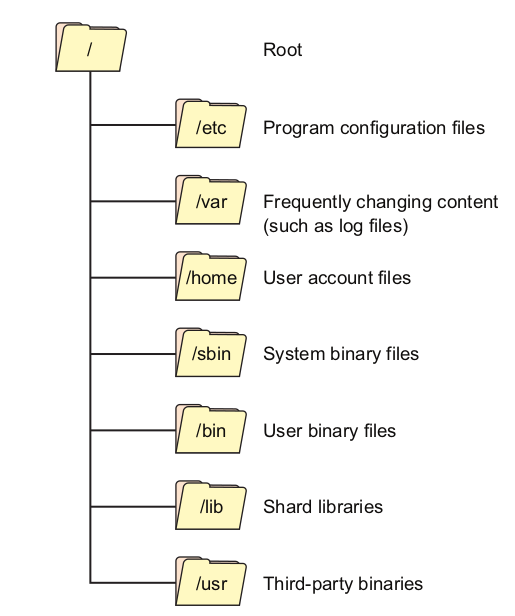

<div dir="rtl" style="font-size:50px; color:yellow">
کتاب لینوکس در عمل
</div>

<div dir="rtl" style="font-size:25px; color:green">
۱.۱ - برای چی لینوکس متفاوت است با سایر سیستم عامل ها؟
</div>


<div dir="rtl" style="font-size:18px">
اولین دلیل ذکر شده رایگان بودن آن است و دلیل بعدی ساده تر بودن ترکیبات سخت افزاری و تنظیمات سرور

میتوانیم یک بوت live از لینوکس در یک USB بریزیم و وقتی هارددیسک خراب شود مشکل را بفهمیم و عیب یابی کنیم(در بخش شماره ۶
میخوانیم)

همچنین لینوکس یک سیستم عامل چند کاربره هست و هر کاربری به صورت همزمان میتواند از راه دور و با اطمینان از حفظ حریم خصوصی
با سیستم کار کنند

توزیع های لینوکس هریک مدیریت بسته های نرم افزاری پیچیده ای رو ارایه میدهند که به‌طور قابل اعتماد هر یک از هزاران
نرم‌افزار رایگان را نصب و نگهداری می‌کنند.

مهمترین دلیل تفاوت سیستم عامل لینوکس با دیگر سیستم عامل ها اینه که لینوکس متن باز (open source) هست و این یعنی میتونیم
به کدهاش دسترسی داشته باشیم و طبق چیزی که میخوایم میتونیم تغییر بدیم

دلیل دیگه اینه که یک کامینیوتی بزرگ و فعال داره و هر مشکلی بخوری میتونی راه حل مشکلت رو از اینترنت بدست بیاری
</div>

<div dir="rtl" style="font-size:25px; color:green">
۱.۲ - مهارت های ابتدایی
</div>

<div dir="rtl" style="font-size:18px">
در این بخش دستورات شامل سلسله مراتب فایل های سیستم یعنی فایل های ایجاد شده چه هستند و وظایفشون چیه

دستورات جهتیابی (ls,pwd,cd)

دستورات مدیریت فایل(cat,less,touch,mkdir,rmdir,rm,cp,mv)

همچنین دستورات کمکی که اطلاعاتی راجب سایر دستورات به ما میدهند(info,man)

</div>

<div dir="rtl" style="font-size:20px; color:orange">
۱.۲.۱ - فایل های سیستمی لینوکس
</div>

<div dir="rtl" style="font-size:18px">
همه چیز در لینوکس از فایل تشکیل شده است که سیستم عامل این فایل هارو شاخص گذاری میکنه (index). این شاخص به طور مداوم مارا به سمت داده هایی 
که نیاز داریم میبرد.

یک فایل سیستم به چنین شاخصی برای ارایه مجموعه سازمان یافته از پوشه ها و فایل ها در یک بخش دیسک نیاز داره که بهش پارتیشن
میگن

تمام فایل های یک پارتیشن در پوشه root نگهداری میشوند که دارای آدرس ("/") است. نحوه چیدمان این دایرکتوری معمولا توسط
استاندارد سلسله مراتب Unix اداره میشود

برخی از پوشه های سطح بالا سیستم:

/etc/:

شامل فایل های تنظیمات هست و نحوه عملکرد برنامه رو مشخص میکند

/var/:

شامل تمام اطلاعات متغیر های متعلق به سیستم یا برنامه های کاربردی است که محتوای آن ها در طول فعالیت تغییر میکند .

/home/:

شامل یک پوشه home برای هر کاربر است برای مثال اگر
اسم user شما admin باشد یک پوشه به اسم admin در home وجود دارد
این پوشه شامل فایل های داده کاربر و فایل های تنظیمات خاص کاربر است. هرکاربر فقط به پوشه خانه خود دسترسی دارد و باید
کاربر اصلی وارد شود تا بتواند سایر فایل هارا ببیند و اصلاح کند

/bin/:

شامل باینری های اصلی کاربر از قبیل برنامه ها و دستورات میباشد. برنامه های مهم سیستمی و ابزارهای پر اهمیت مثل shell در
این پوشه قرار دارد

/usr/:

این پوشه و پوشه های درون آن حاوی کتابخانه های برنامه نویسی و اسناد و برنامه ها و حتی کد های برنامه هایی هستند که در
سیستم نصب شده اند و توسط کاربر اجرا میشوند

/boot/:

تمامی فایل های مرتبط با هسته اصلی لینوکس و بوت لینوکس اعم از boot loader در این پوشه وجود دارد و هسته لینوکس در این پوشه
ذخیره شده اند. هنگام بوت شدن لینوکس از این پوشه فایل های مورد نیاز فراخوانی میشود

/mnt/:

این پوشه برای mount کردن ابزارهای ذخیره سازی استفاده میشود. این مسیر توسط مدیر سیستم برای متصل کردن ابزارهای جانبی
استفاده میشود

/tmp/:

پوشه موقت سیستم که قابل دسترسی توسط کاربران. ذخیره فایل های موفقت برای کاربر و سیستم تا بوت بعدی. فایل هایی که باید به
صورت موفقت ایجاد شوند. مثلا وقتی فایلی را فشرده میکنید در این پوشه از حالت فشرده خارج میشود و معمولا فایل های درون این
مسیر در هر بار اجرای دوباره لینوکس پاک میشوند.
</div>



<div dir="rtl" style="font-size:20px; color:orange">
۱.۲.۲ - ابزارهای جابه جایی در لینوکس
</div>

<div dir="rtl" style="font-size:18px">

ابتدا باید ترمینال خودمون رو باز کنیم با دستور میانبر ctrl + alt + t یا اینکه به صورت گرافیکی در منو باز شده عبارت
terminal رو جستوجو کنیم

دستورات جابه جایی و رفت و آمد در لینوکس:

1-ls:
این دستور لیستی از پوشه ها و فایل هایی که در مسیری که هستید نمایش میدهد
</div>

```commandline
ls
'design pattern'  'linux in action'   venv

```

<div dir="rtl" style="font-size:18px">
اگر از سوییچ l- استفاده کنیم جزییات بیشتری را نمایش میدهد
</div>

```commandline
ls -l
total 12
drwxrwxr-x 5 mehran mehran 4096 Jul  4 17:02 'design pattern'
drwxrwxr-x 3 mehran mehran 4096 Jul  4 20:44 'linux in action'
drwxrwxr-x 5 mehran mehran 4096 Jul  4 01:23  venv

```

<div dir="rtl" style="font-size:18px">
اگر از سوییچ h- همراه با l- استفاده کنیم آنگاه میزان حجم فایل هایی که نمایش میدهد به صورت خواناتر میشود یعنی به کیلوبایت و مگابایت و ... در می آید
</div>

```commandline
ls -lh
total 12K
drwxrwxr-x 5 mehran mehran 4.0K Jul  4 17:02 'design pattern'
drwxrwxr-x 3 mehran mehran 4.0K Jul  4 20:51 'linux in action'
drwxrwxr-x 5 mehran mehran 4.0K Jul  4 01:23  venv

```

<div dir="rtl" style="font-size:18px">
اگر بخواهیم اطلاعات کلی از پوشه و پوشه هایی که داخل این مسیر هستند پیدا کنیم میتوانیم با سوییچ R- این کار را انجام دهیم
</div>

```commandline
 ls -R
.:
'design pattern'  'linux in action'   venv

'./design pattern':
Behavioral  Creational  Structural

'./design pattern/Behavioral':

'./design pattern/Creational':
builder  factory  prototype  singleton

'./design pattern/Creational/builder':
builder.md  builder.py

'./design pattern/Creational/factory':
factory.md  factory_method.md  factory_method.py  factory.py

'./design pattern/Creational/prototype':
prototype.md  prototype.py

'./design pattern/Creational/singleton':
example1.py  singleton.md  singleton.py

'./design pattern/Structural':

'./linux in action':
chapter1.md  pic

'./linux in action/pic':
img.png
```

