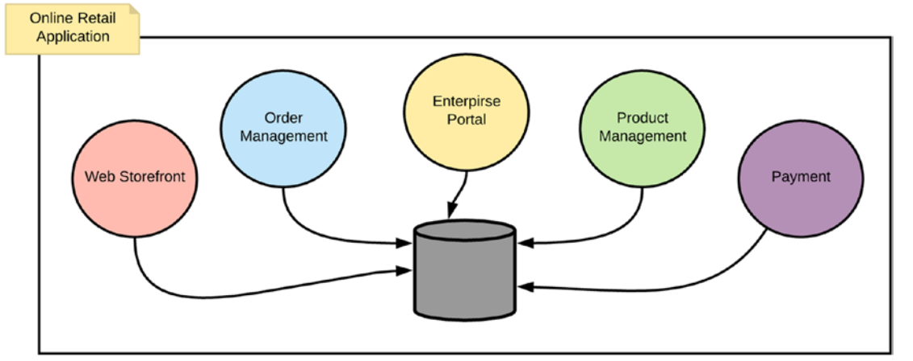
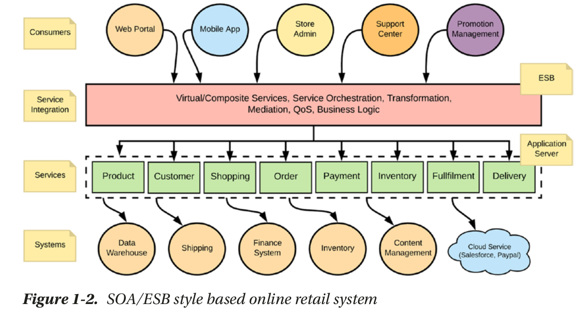
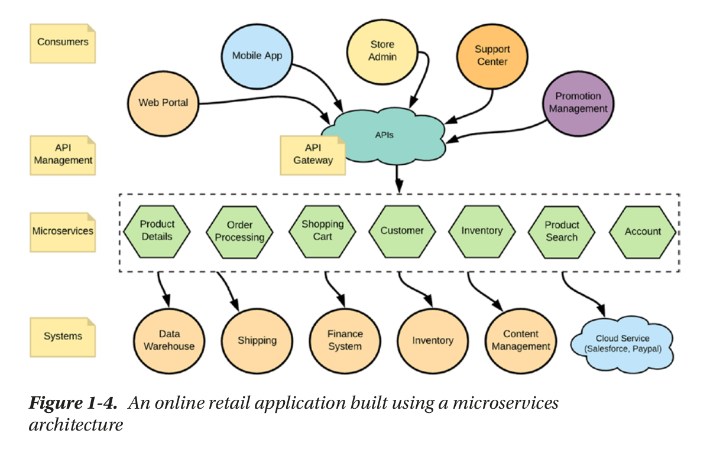

فصل اول

 

معماری یکپارچه (Monolithic)

تمامی عملکردهای کسب‌وکار در یک برنامه یکپارچه انباشته شده و به عنوان یک واحد واحد ساخته می‌شوند.

 
 

کل برنامه خرده‌فروشی شامل چندین مؤلفه مانند مدیریت سفارشات، پرداخت‌ها، مدیریت محصولات و غیره است. هر یک از این مؤلفه‌ها طیف گسترده‌ای از قابلیت‌های کسب‌وکار را فراهم می‌کنند. به دلیل ماهیت یکپارچه بودن سیستم، افزودن یا تغییر یک قابلیت در یک مؤلفه بسیار هزینه‌بر بود. همچنین، برای پاسخگویی به نیازهای کلی کسب‌وکار، این مؤلفه‌ها باید با یکدیگر در ارتباط باشند. ارتباطات بین این مؤلفه‌ها اغلب بر پایه پروتکل‌ها و استانداردهای اختصاصی بود و به سبک ارتباط نقطه به نقطه انجام می‌شد. بنابراین، تغییر یا جایگزینی یک مؤلفه خاص بسیار پیچیده بود. به عنوان مثال، اگر شرکت خرده‌فروشی می‌خواست به یک سیستم مدیریت سفارش جدید منتقل شود و سایر مؤلفه‌ها را حفظ کند، انجام این کار نیازمند تغییرات زیادی در سایر مؤلفه‌های موجود نیز بود.

 

معماری سرویسگرا (SOA)

 

این معماری بر اساس تفکیک کل برنامه به سرویس های مختلف است به طوری که همه سرویس ها از یک دیتابیس استفاده میکنند و نحوه ارتباط آن‌ها با استفاده از ESB است. 

 

میکروسرویس (Microservice)

 

در این معماری سرویس ها به سرویس های کوچیک تر از SOA تقسیم میشوند. و همچنین هر سرویس دارای پایگاه داده مخصوص به خود است. در این معماری ESB حذف شده و با استفاده از api getway متوجه میشود که کدام سرویس اجرا شود

