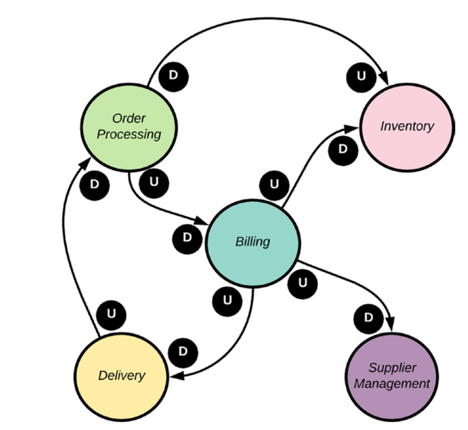

فصل دوم

 

دامنه

 

دامنه در مفهوم کلی به محدوده یا حوزه‌ای از فعالیت یا علم اشاره دارد.

 

در یک برنامه مدیریت فروش، دامنه ممکن است شامل مفاهیم مانند مشتریان، محصولات، سفارشات و پرداخت‌ها باشد. دامنه به‌طور کلی مرتبط با حوزه‌ی عملکرد یا مسئولیت‌های یک سیستم است که معمولاً در یک زمینه یا دسته‌بندی خاص فعالیت می‌کند.

 

به طور مثال در شرکت ادتریس دامنه تجزیه و تحلیل داده های کاربران مدیریت کمپین‌ها است.

 

bounded context

 

به طور خلاصه، Bounded Context یک حوزه یا بخش معین از سیستم است که دارای مفهوم و اطلاعات مشترکی است که توسط یک یا چندین سرویس تجسم می‌یابد.

 

به طور مثال در شرکت adtrace :
در دامنه تحلیل داده کاربران، ما ممکن است با یک Bounded Context مواجه شویم که همه اطلاعات مربوط به کاربران، عملکرد برنامه‌ها، رفتارهای کاربری و داده‌های مرتبط را شامل می‌شود. این Bounded Context به تیم تحلیل داده‌ها اجازه می‌دهد تا به صورت مستقل از سایر بخش‌های سیستم، روی تجزیه و تحلیل داده‌ها تمرکز کنند و از تعاملات و تغییرات در دامنه مربوط به مدیریت کمپین‌ها خودداری کنند.

در دامنه مدیریت کمپین‌ها، ممکن است یک Bounded Context وجود داشته باشد که همه اطلاعات و عملیات مربوط به مدیریت کمپین‌ها را در بر می‌گیرد، از جمله اطلاعات مربوط به تنظیم کمپین‌ها، مدیریت نمایش تبلیغات، و بررسی عملکرد کمپین‌ها. این Bounded Context به تیم مدیریت کمپین‌ها اجازه می‌دهد تا به صورت مستقل از سایر بخش‌های سیستم، روی مدیریت و بهینه‌سازی کمپین‌ها تمرکز کنند و از تعاملات مستقیم با بخش تحلیل داده‌ها دوری کنند.

 

Context Maped

 

Context Map یا نقشه‌ی زمینه، ابزاری مفید برای تجسم وابستگی‌های بین میکروسرویس‌ها در یک معماری میکروسرویس است. این ابزار به شما کمک می‌کند تا جریان داده بین میکروسرویس‌ها را درک کنید و نقاط بالقوه شکست را شناسایی کنید.

در شکل بالا u یعنی upstream یعنی بالا دست که به سرویس دیگه وابسته هست. و D یعنی Down stream به معنی اینکه به سرویس دیگه اطلاعات و داده میفرستد

 

ACL

 

لایه ضد فساد بین دو سرویس قرار میگیره و وظیفه تبدیل اطلاعات به فرمتی که سرویس ها قادر به خواندن آن هستند میکند.

 

تفاوت آن با Adaptor این است که Adaptor در هر سرویس قرار میگیرد و به لاجیک سرویس اشنایی دارد و داده رو طبق اون چیزی که سرویس خودش میخواد تبدیل میکنه. یعنی اداپتر برای دریافت داده هست که داده ای که میاد تبدیل میشه به داده ای که سرویس میتونه دریافت کنه

ولی acl یدونه بین دو سرویس هست 

 

Sidecare

 

 این الگو دقیقا مثل microservice commonse در ادتریس هست که برای  اطلاعاتی که میخوای که در سرویس دیگه ای هست میتونیم یه کلاس داشته باشیم که بره اطلاعاتی که میخوایم رو از سرویس دیگه بگیره و تحویل بده بهمون  

 طور کلی کلاسی از واسطه‌ها هستند که می‌توانند علاوه بر ارتباط با سرویس‌های دیگر، وظایف دیگری مانند ارتباط با ابزارها، جمع‌آوری اطلاعات، پردازش داده‌ها و ارسال درخواست‌ها را نیز انجام دهند.

وظایف اصلی Sidecar:

ارتباط با سرویس‌های دیگر: Sidecar می‌تواند از طریق HTTP، gRPC، پیام‌رسانی یا روش‌های دیگر با سرویس‌های دیگر ارتباط برقرار کند.
 
ارتباط با ابزارها: Sidecar می‌تواند با ابزارهایی مانند Elasticsearch، Splunk، ELK Stack، Prometheus و Grafana برای ثبت وقایع، مشاهده، جمع‌آوری معیارها و تجزیه و تحلیل داده‌ها ارتباط برقرار کند.
 
جمع‌آوری اطلاعات: Sidecar می‌تواند اطلاعات از منابع مختلف مانند پایگاه‌های داده، APIها و فایل‌های پیکربندی جمع‌آوری کند.
 
پردازش داده‌ها: Sidecar می‌تواند داده‌های جمع‌آوری شده را فیلتر، تبدیل یا غنی‌سازی کند.
 
ارسال درخواست‌ها: Sidecar می‌تواند درخواست‌ها را به سرویس‌های دیگر یا به طور مستقیم به APIها ارسال کند.
 

 

Shared Kernel

 

این الگو برای زمانی هست که سرویس هایی که باهم در ارتباط هستند هردو یک کار رو انجام دهند مثلا احراز هویت.

این می‌تواند در مواردی اتفاق بیفتد که دو یا چند حوزهٔ محدود دارای مواردی مشترک هستند. 

