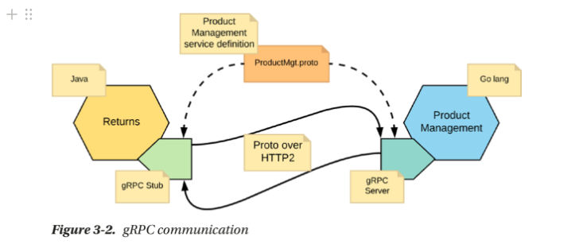

فصل سوم

 

Inter-Service Communication

 

در معماری میکروسرویس، سرویس‌ها مستقل هستند و از طریق شبکه با یکدیگر ارتباط برقرار می‌کنند تا یک مورد کاربرد تجاری را پوشش دهند.

ارتباطات بین سرویس‌ها عامل کلیدی در موفقیت معماری میکروسرویس محسوب می‌شود.

 

Synchronous Communication

 

در روش ارتباط همگام(sync)، مشتری (client) یک درخواست ارسال کرده و منتظر پاسخ از سرویس می‌ماند. هر دو طرف موظفند تا زمانی که مشتری پاسخ را دریافت نکند، ارتباط را باز نگه دارند. منطق اجرایی مشتری بدون دریافت پاسخ ادامه پیدا نمی‌کند. در مقابل، در ارتباط ناهمگام، مشتری می‌تواند یک پیام ارسال کند و کاملاً به پایان برسد بدون اینکه منتظر پاسخ شود.

 

البته ارتباط همگام با مسدود کننده تفاوت دارد. در ارتباط همگام میتونه درخواست بده به سرویس ولی بره بقیه کد رو اجرا کنه و بعدا جواب رو بگیره ولی در همگام مسدود کننده صبر میکنه تا جواب بیاد بعد ادامه کد را اجرا میکند.

 

1-Rest

 

این REST  به هیچ یک از پروتکل‌های اجرایی وابسته نیست، اما پروتکل برنامه HTTP از پرکاربردترین اجرایی‌ها است. در دسترسی به منابع RESTful با پروتکل HTTP، URL منبع به عنوان شناسه منبع عمل می‌کند و GET، PUT، DELETE، POST و HEAD به عنوان عملیات استاندارد HTTP بر روی آن منبع انجام می‌شوند. معماری REST به طور ذاتی بر مبنای پیام‌رسانی همگام است.

 

2-GRPC

 

یک تکنولوژی ارتباطی برای ساخت برنامه‌های کلاینت-سرور در سیستم‌های توزیع‌شده است.  این تکنولوژی بر ایده‌ء تعریف یک سرویس و مشخص کردن متدهای قابل فراخوانی به‌صورت دور از طریق پارامترها و انواع بازگشتی خود تمرکز دارد.

در تصویر بالا دو سرویس وجود داره:

1. سرویس کالاهای بازگشتی
2. سرویس مدیریت محصول

این دو سرویس با استفاده از پروتکل grpc باهم در ارتباط هستند. یک فایل ProductMgt.proto مشترک وجود داره که پیام باینری شده که به سرویس ها اومده رو میتونیم با اون ترجمه کنیم

یعنی در فایل ProductMgt.proto اون ساختار grpc رو میزارن که سرویس ها بتوانند اون پیام های باینری رو ترجمه کنند.

 

3-A Glimpse of HTTP2

 

علارقم پذیرش گسترده  HTTP1.1، دارای محدودیت هایی هست:

1. مسدود کننده هست(Head of line blocking) . یعنی هر اتصال قادر به انجام یک درخواست در یک زمان است. اگر درخواست فعلی مسدود شود، درخواست بعدی منتظر خواهد ماند. بنابراین، برای پشتیبانی از موارد استفاده واقعی، می‌بایست چند اتصال بین مشتری و سرور حفظ شود. HTTP 1.1 یک لوله‌گذاری (Pipeline) تعریف کرده است تا این محدودیت را برطرف کند، اما به طور گسترده مورد استفاده قرار نگرفته است.
2. هدرها در چندین درخواست تکرار میشود. به عنوان مثال اطلاعاتی مثل user-agent یا cookie به طور مکرر ارسال میشوند که باعث اتلاف پهنای باند میشود

بزرگترین تغییر HTTP/2 در این است که تمام ارتباطات بین مشتری و سرور از طریق یک اتصال TCP انجام می‌شود که می‌تواند همه جریان‌های دوطرفه بایت را حمل کند. این به معنای این است که از این پس هر درخواست یک اتصال جدید ایجاد نخواهد شد و مشکلات Head of line blocking کاهش می‌یابد. HTTP/2 از مفهوم جریان و فریم برای ارتباط استفاده می‌کند که امکان حمل یک یا چند پیام را در یک اتصال فراهم می‌کند.

این پروتکل از تکرار هدرها جلوگیری کرده و از فشرده‌سازی هدر برای بهینه‌سازی پهنای باند استفاده می‌کند.

 

4-GraphQL

 

این GraphQL یک زبان پرس‌وجو برای APIs است که امکان دسترسی به داده‌ها را از سمت کلاینت فراهم می‌کند. در مقابل REST که بر اساس مفهوم منابع (resources) و اعمال عملیات HTTP ساخته شده است، GraphQL اجازه می‌دهد تا کلاینت دقیقاً آن داده‌هایی که نیاز دارد را در یک درخواست بخواهد و دریافت کند. بنابراین، GraphQL امکانات زیادی برای انعطاف‌پذیری در دسترسی به داده‌ها، کاهش انتقال زائد داده، و توسعه‌پذیری API فراهم می‌کند.

 

Asynchronous Communication

 

در اکثر اجراهای اولیه معماری میکروسرویس، ارتباط همزمان به عنوان الگوی ارتباط بین سرویس‌ها به عنوان استاندارد در نظر گرفته می‌شود. با این حال، ارتباط ناهمزمان بین میکروسرویس‌ها به عنوان یک الگوی ارتباطی روز به روز محبوب‌تر می‌شود چرا که سرویس‌ها را مستقل‌تر می‌کند.

 

Single Receiver

 

در این الگو، یک پیام خاص به صورت قابل اطمینان از تولیدکننده به دقیقاً یک مصرف‌کننده ارسال می‌شود. این ارتباط از طریق یک پیام‌رسان انجام می‌شود.

 

ویژگی اصلی این الگو این است که این ارتباط به صورت ناهمزمان است، به این معنا که تولیدکننده منتظر پاسخ از مصرف‌کننده نمی‌ماند و نه در زمان تولید پیام. این مسئله مفید است زمانی که نیاز به ارسال دستورات مبتنی بر پیام از یک میکروسرویس به میکروسرویس دیگر وجود دارد.

 

فرض کنید یک سیستم تجارت الکترونیک داریم که دارای سرویس‌های مختلفی برای مدیریت موجودی، سفارشات و پرداخت‌ها است. زمانی که یک مشتری یک سفارش ثبت می‌کند، سیستم نیاز دارد تا اطلاعات موجودی کالاها را به‌روز کند. از Single Receiver Mode می‌توان برای ارسال یک پیام ناهمزمان به سرویس مدیریت موجودی برای به‌روزرسانی اطلاعات استفاده کرد. در اینجا، مهم نیست که سرویس مدیریت موجودی در زمان درخواست پاسخ دهد؛ بلکه مهم است که پیام به صورت امن و قابل اعتماد به مقصد منتقل شود.

 

AMQP

 

در این پروتکل، ارتباطات همگام و ناهمگام بین پیام‌رسان‌ها و مصرف‌کننده‌ها انجام می‌شود.

 

یکی از مفاهیم مهم در AMQP، قلب‌زنی (heartbeat) است که برای اطمینان از سلامت اتصالات و همتاهای پاسخگو در لایه برنامه مسئول است. قلب‌زنی همچنین با تجهیزات شبکه کار می‌کند که ممکن است اتصال‌های TCP خاموش را پایان دهند.

 

امکان ارسال اطمینان‌نامه‌ها (acknowledgements) نیز در AMQP وجود دارد که به مصرف‌کنندگان این امکان را می‌دهد که به سرور اعلام کنند که پیام را با موفقیت دریافت کرده‌اند. از اطمینان‌نامه‌ها می‌توان برای اعلام موفقیت دریافت پیام به تولیدکننده نیز استفاده کرد.

 

در موارد شکست شبکه یا خطا، ممکن است پیام‌ها تکرار شوند و مصرف‌کنندگان باید آماده باشند که با آنها برخورد کنند. راه‌حل‌هایی برای جلوگیری از تکرار پیام‌ها نیز ارائه شده است، از جمله استفاده از رفتار ایدمپتنت در پردازش پیام‌ها.

 

 

Multiple Receivers

 

زمانی که پیام‌های ناهمگام تولید شده توسط یک تولیدکننده به بیش از یک مصرف‌کننده بروند، ارتباط به سبک انتشار-اشتراک یا چند گیرنده مفید است. به عنوان یک مثال کاربرد، فرض کنید که یک سرویس مدیریت محصول وجود دارد که اطلاعات به‌روزرسانی قیمت محصولات را تولید می‌کند. این اطلاعات باید به چندین میکروسرویس مختلف مانند سبد خرید، شناسایی تقلب، اشتراک‌ها و غیره منتقل شود.

 

KAFKA

 

یک سیستم پیام‌رسانی انتشار-اشتراک موزع است. اغلب آن را به عنوان یک commit log توزیع‌شده توصیف می‌کنند، زیرا داده‌ها در داخل Kafka به صورت دائمی، به ترتیب و به صورت قطعی ذخیره می‌شوند.

واحد داده‌ای که در Kafka استفاده می‌شود به نام "پیام" معروف است که یک آرایه از بایت‌ها است. برخلاف سایر پروتکل‌های پیام‌رسانی، داده‌های درون یک پیام در Kafka فرمت یا معنی خاصی ندارند. پیام‌ها همچنین می‌توانند حاوی متاداده (metadata) باشند که می‌تواند در انتشار یا مصرف پیام‌ها مفید باشد.

 

Synchronous versus Asynchronous Communication

 

تفاوت اصلی بین ارتباط همگام و ناهمگام این است که در برخی سناریوها امکان حفظ ارتباط باز بین یک مشتری و یک سرور وجود ندارد. در این سناریوها، ارتباط یک‌طرفه مستدام عملی‌تر است. ارتباط همگام در سناریوهایی که نیاز به ساخت سرویس‌هایی با تعاملات درخواست-پاسخ دارید، مناسب‌تر است. اگر پیام‌ها به شیوه محور رویدادی باشند و مشتری انتظار پاسخ فوری نداشته باشد، ارتباط ناهمگام مناسب‌تر است.

 

Message Formats/Types

 

1. فرمت JSON and XML: در بسیاری از پیاده‌سازی‌های مبتنی بر REST برای میکروسرویس‌ها، JSON به عنوان فرمت اصلی برای تبادل پیغام مورد استفاده قرار می‌گیرد. این انتخاب به دلیل سادگی، خواناتری بودن، و عملکرد بهتر JSON است. اما برخی سرویس‌ها ممکن است از XML برای تبادل پیغام استفاده کنند، اگرچه معمولاً کاربرد XML در موارد خاص تر محدود است. در هنگام توسعه سرویس، سرویس باید قادر به پردازش پیغام‌های ورودی JSON یا XML باشد و آن‌ها را به نوع‌های استفاده شده در کد سرویس نگاشت دهد.
 
2. فرمت protocol Buffer: فرمت‌های پیغام به خوبی تعریف شده‌اند و از یک فرمت تبادل داده اختصاصی مانند Protocol Buffers استفاده می‌شود. توسعه‌دهنده سرویس نیازی به نگرانی در مورد پردازش پیغام‌ها در یک فرمت خاص ندارد. در هنگام مارشالینگ و آنمارشالینگ، تمام مپینگ نوع مورد نیاز انجام می‌شود و کاربران فقط با نوع‌های دقیق و مشخص سرویس سر و کار دارند. به دلیل مکانیزم انعطاف‌پذیر، کارآمد و خودکار سریالیزیشن و دیسریالیزیشن داده، Protocol Buffers برای ارتباطات همگام با توان خروجی بالا بین سرویس‌های داخلی ایده‌آل هستند.
 
3. فرمت AVRO: یک سیستم سریالیزیشن داده است که به مشکلات اصلی بیشتر فرمت‌های رایج مبادله داده مانند JSON و XML پرداخته است. Avro یک سیستم سریالیزیشن داده است که ساختارهای داده غنی را برای نمایش داده‌ها، یک فرمت فشرده، بسته‌بندی عالی برای زبان‌های برنامه‌نویسی مختلف، تطابق مستقیم با JSON، و یک زبان اسکیما قابل گسترش که در قالب JSON تعریف شده، فراهم می‌کند.

