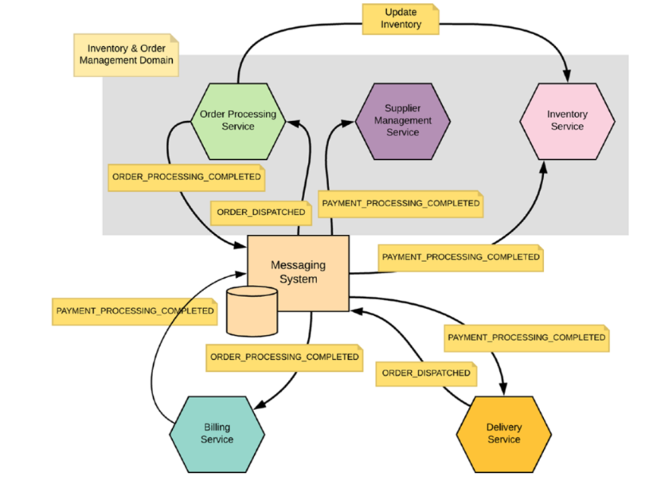

فصل چهارم

 

⚫ Developing Services

 

⚫ ⚫ Netflix OSS

محصول netflix از چندین سرویس ساخته شده:

 

⚫ ⚫ ⚫ Nebula

 

در این سرویس تمام چیزهایی که سرویس های دیگه لازم دارند قرار دارد. این سرویس همون adtrace-commonse هست که محتوای این سرویس در سرویس های دیگه استفاده میشود. مثل کلاس های ساخته شده که در سرویس های دیگه ارث بری میشوند یا enum ها که در سرویس های دیگه استفاده میشوند

 

 یک پلتفرم ابری بومی Kubernetes است که قابلیت های مختلفی مانند مدیریت خوشه، مشاهده، خودکارسازی و امنیت را ارائه می دهد.
این به تیم های مهندسی کمک می کند تا به طور موثر بر برنامه های کاربردی خود در مقیاس بزرگ مدیریت کنند.

 

⚫ ⚫ ⚫ Spinnaker

 

سرویس Spinnaker در Netflix یک پلتفرم خودکارسازی تحویل نرم‌افزار (CI/CD) است که برای مدیریت چرخه عمر برنامه‌های کاربردی استفاده می‌شود. این سرویس از Netflix برای انتشار مداوم برنامه‌های کاربردی خود به محیط‌های تولید استفاده می‌شود.

سرویس Spinnaker به Netflix کمک می‌کند تا برنامه‌های کاربردی خود را به سرعت و با اطمینان منتشر کند. این سرویس شامل ویژگی‌های زیر است:

- مدیریت چرخه عمر برنامه‌های کاربردی: Spinnaker می‌تواند تمام مراحل چرخه عمر برنامه‌های کاربردی را از توسعه تا تولید مدیریت کند. این شامل مراحلی مانند ساخت، آزمایش، تحویل و پیاده‌سازی است.
- انتشار مداوم: Spinnaker از انتشار مداوم برنامه‌های کاربردی پشتیبانی می‌کند. این بدان معناست که برنامه‌های کاربردی می‌توانند در هر زمان و به صورت خودکار منتشر شوند.
- بازیابی خودکار: Spinnaker می‌تواند در صورت بروز مشکل در انتشار برنامه‌های کاربردی، آنها را به حالت قبل از انتشار بازیابی کند.
- 

 

⚫ ⚫ ⚫ Eureka

 

در یک معماری سرویس محور سنتی، ما باید آدرس های سرویس های دیگر را به صورت دستی در کد سرویس زیرین خود وارد می کردیم. این می تواند دشوار و زمان بر باشد، به خصوص اگر تعداد زیادی سرویس وجود داشته باشد.

با استفاده از Eureka، ما می توانیم آدرس های سرویس های دیگر را به صورت خودکار در کد سرویس زیرین خود وارد کنیم. برای این کار، فقط باید سرویس زیرین خود را با Eureka ثبت نام کنیم.

این سرویس بخشی از **microservice-commonse** هست

⚫ ⚫ ⚫ Archaius

 

این سرویس وظیفه تنظیمات هر سرویس به صورت داینامیک رو به عهده داره. این سرویس همون shaya-commonse ماهست

 

⚫ ⚫ ⚫ Ribbon

 

سرویس Ribbon که از Eureka اطلاعات سرویسی که میخواد رو گرفته و به اون سرویس رکوئست میزنه. این سرویس با الگوریتم هایی که داره باعث توزیع بار و رکوئست به سرویس ها میشه.

این سرویس همراه با Eureka میشه همون microservice-commonse  که در حال استفاده هست.

 

Zuul

 

 ترافیک HTTP را به سرویس های زیرین توزیع می کند.
 دسترسی به سرویس های زیرین را کنترل می کند.
 آمار و گزارش های مربوط به ترافیک را جمع آوری می کند.

