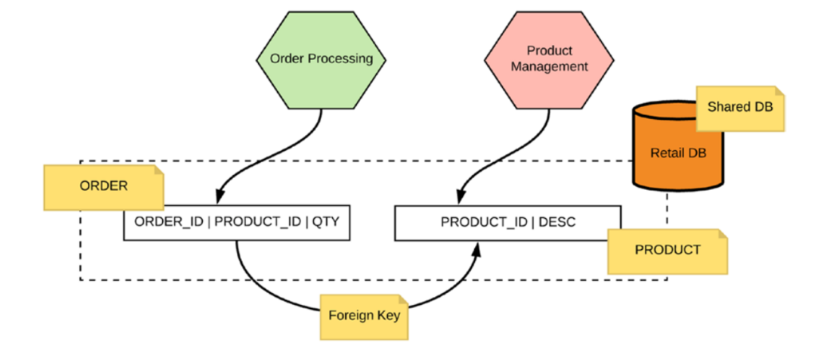

فصل پنجم

 

⚫ Data Management

 

در پایگاه داده مونولیتیک، به راحتی می‌توان به هر ترکیب دلخواه داده پرداخت چرا که یک پایگاه داده مونولیتیک واحد را به اشتراک می‌گذاریم. اما در محیط میکروسرویسی، هر قطعه داده توسط یک سرویس تکمیل شده و از یک سیستم ثبت شده استفاده می‌کند. برای دسترسی به داده متعلق به یک میکروسرویس دیگر، تنها راه از طریق رابط سرویس یا API است.

 

⚫ ⚫ Eliminating Shared Tables

 

وقتی یک جدول بین دو یا چند میکروسرویس به اشتراک گذاشته می‌شود، هر تغییر در طرح این جدول ممکن است تأثیرگذار باشد. راه‌حل برای این مشکل این است که داده مربوط به هر میکروسرویس در جداول جداگانه قرار گیرد و خدمات مسئولیت نگهداری هماهنگی داده‌ها را از طریق API منتشر شده دارند.

 

⚫ ⚫ Shared Data

 

در حالت مونولوتیک اینطوریه:

 

⚫ ⚫ ⚫ Synchronous Lookups

 

هر میکروسرویس برای دسترسی به داده دیگر، می‌تواند API منتشر شده آن میکروسرویس را استفاده کند. این رویکرد در دسترسی همگام به داده ساده است ولی از کنسیستانسی معمولی ناهمگام فاقد است.

⚫ ⚫ ⚫ Using Asynchronous Events

 

از الگوی ارتباط با رویدادها (الگوی منتشرکننده-گوش‌دهنده) می‌توان برای به اشتراک گذاری داده بین سرویس‌ها استفاده کرد. این رویکرد، با توجه به مزایا و چالش‌ها، به دسترسی به داده‌های ناهمگام کمک می‌کند.

 

⚫ ⚫ Data Composition

 

اگر جداولمون یکپارچه بود در اون صورت میتونیستیم داده هامون رو باهم ترکیب کنیم ولی چون هر میکروسرویس دیتابیس خودش رو ترکیب داده سخته. 

روش های مختلفی وجود داره برای ترکیب داده:

 

Zuul

 

 ترافیک HTTP را به سرویس های زیرین توزیع می کند.
 دسترسی به سرویس های زیرین را کنترل می کند.
 آمار و گزارش های مربوط به ترافیک را جمع آوری می کند.

