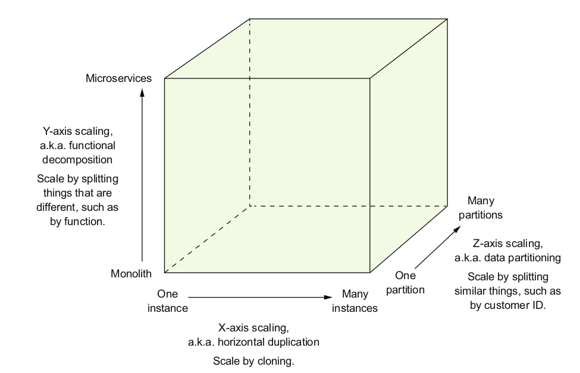
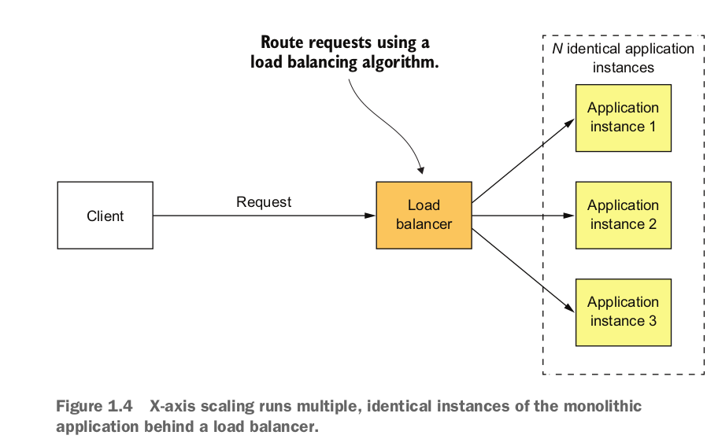
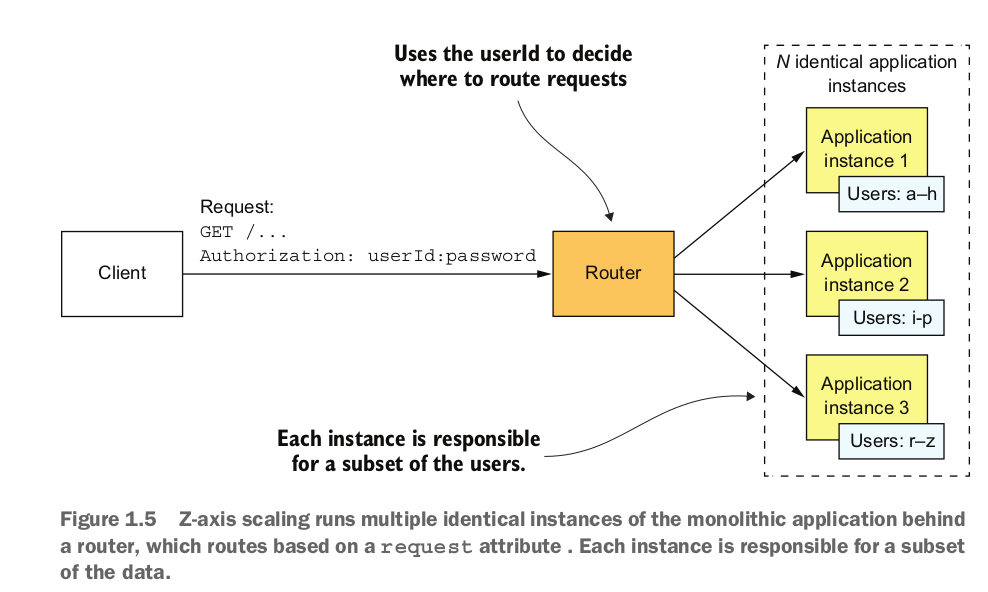
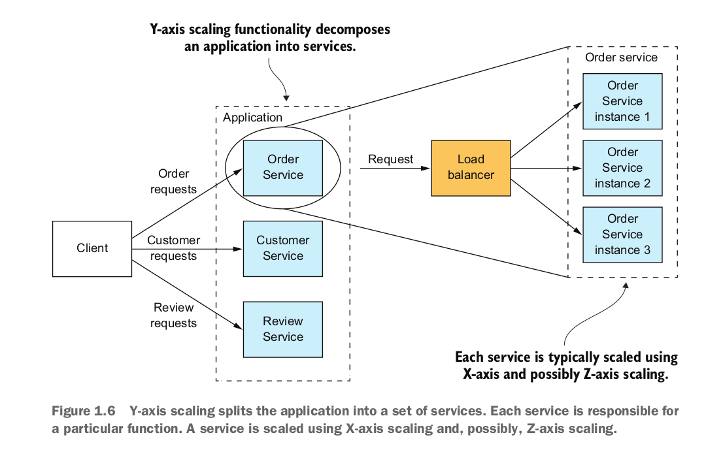
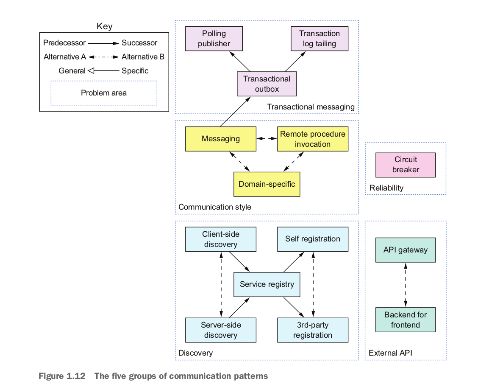
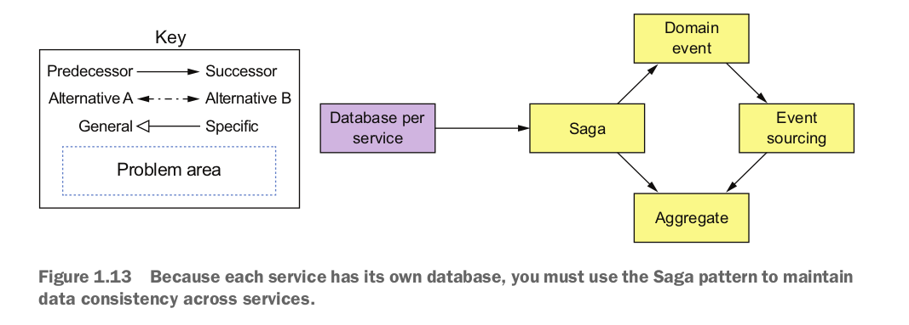
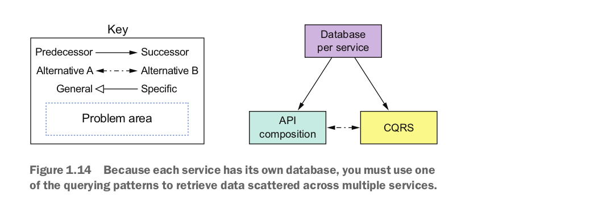

فصل اول

 

مفهوم Scale Cube

مکعب مقیاس (Scale Cube) یک مدل سه‌بعدی برای مقیاس‌پذیری است که توسط Martin Abbott و Michael Fisher در کتاب The Art of Scalability معرفی شده است. این مدل به سه بعد اصلی برای مقیاس‌پذیری یک سیستم اشاره دارد:

 

1- مقیاس‌پذیری افقی (x-axis) یا Horizontal Scaling:

 

مقیاس‌پذیری محور X یک روش رایج برای مقیاس‌پذیری برنامه‌های یکپارچه (Monolithic) است. در این روش، چندین نمونه از برنامه را پشت یک لود بالانسر (Load Balancer) اجرا می‌کنید. لود بالانسر درخواست‌ها را بین N نمونه یکسان از برنامه توزیع می‌کند. این روش، راهی عالی برای بهبود ظرفیت و در دسترس بودن برنامه است.

 

2- Z-axis (عمق) - مقیاس‌پذیری مبتنی بر تقسیم (Decomposition Scaling)

 

در مقیاس‌پذیری محور Z نیز چندین نمونه از برنامه یکپارچه اجرا می‌شود، اما برخلاف مقیاس‌پذیری محور X، هر نمونه مسئولیت فقط بخشی از داده‌ها را بر عهده دارد. مسیریاب در جلوی نمونه‌ها، با استفاده از یک ویژگی درخواست، آن را به نمونه مناسب هدایت می‌کند. به عنوان مثال، یک برنامه ممکن است درخواست‌ها را بر اساس userId مسیریابی کند.

 

3- Y-axis (عمودی) - مقیاس‌پذیری عمودی (Vertical Scaling)

 

مقیاس‌پذیری محور X و Z ظرفیت و دسترسی‌پذیری یک برنامه را بهبود می‌بخشند. اما هیچ‌کدام از این روش‌ها مشکل افزایش پیچیدگی توسعه و برنامه را حل نمی‌کنند. برای حل این مشکلات، باید از مقیاس‌پذیری محور Y یا تجزیه عملکردی استفاده کنید. مقیاس‌پذیری محور Y مثل شکل زیر عمل می‌کند: با تقسیم یک برنامه یکپارچه به مجموعه‌ای از سرویس‌ها.

 

 

تفاوت های بین SOA و Microservice:

 

SOA و معماری میکروسرویس‌ها معمولاً از تکنولوژی‌های مختلف استفاده می‌کنند. برنامه‌های SOA معمولاً از تکنولوژی‌های سنگین مانند SOAP و سایر استانداردهای WS* بهره می‌برند. این برنامه‌ها اغلب از یک ESB (Enterprise Service Bus) استفاده می‌کنند که لوله‌ای هوشمند است و شامل منطق کسب‌وکار و پردازش پیام‌ها برای ادغام سرویس‌ها می‌باشد. در مقابل، برنامه‌هایی که با معماری میکروسرویس‌ها ساخته می‌شوند، معمولاً از تکنولوژی‌های سبک و منبع باز استفاده می‌کنند. این سرویس‌ها از لوله‌های ساده مانند پیام‌رسان‌ها یا پروتکل‌های سبک مانند REST یا gRPC برای ارتباط استفاده می‌کنند.

SOA و معماری میکروسرویس‌ها همچنین در نحوه مدیریت داده‌ها تفاوت دارند. برنامه‌های SOA معمولاً از یک مدل داده جهانی و پایگاه‌های داده مشترک بهره می‌برند. در مقابل، همان‌طور که قبلاً ذکر شد، در معماری میکروسرویس‌ها، هر سرویس پایگاه داده خاص خود را دارد. علاوه بر این، همان‌طور که در فصل ۲ توصیف شده است، هر سرویس معمولاً مدلی از دامنه خاص خود را دارد.

تفاوت کلیدی دیگر بین SOA و معماری میکروسرویس‌ها اندازه سرویس‌ها است. SOA معمولاً برای ادغام برنامه‌های بزرگ و پیچیده یکپارچه استفاده می‌شود. اگرچه سرویس‌های موجود در معماری میکروسرویس‌ها همیشه بسیار کوچک نیستند، اما تقریباً همیشه بسیار کوچک‌تر از سرویس‌های SOA هستند. در نتیجه، یک برنامه SOA معمولاً شامل چندین سرویس بزرگ است، در حالی که یک برنامه مبتنی بر میکروسرویس‌ها معمولاً شامل ده‌ها یا صدها سرویس کوچکتر است.

 

PATTERNS FOR DECOMPOSING:(نحوه تجزیه )

 

تقسیم‌بندی بر اساس قابلیت کسب‌وکار که سرویس‌ها را بر اساس قابلیت‌های کسب‌وکار سازماندهی می‌کند، و تقسیم‌بندی بر اساس زیردامنه که سرویس‌ها را بر اساس زیردامنه‌های طراحی مبتنی بر دامنه (DDD) سازماندهی می‌کند.

 

1- تقسیم‌بندی بر اساس قابلیت کسب‌وکار
در این روش، سرویس‌ها بر اساس قابلیت‌های اصلی کسب‌وکار سازماندهی می‌شوند. مثلاً در یک فروشگاه آنلاین، برخی از قابلیت‌های کلیدی کسب‌وکار شامل مدیریت موجودی، پردازش سفارشات و مدیریت مشتریان است. هر یک از این قابلیت‌ها می‌تواند به عنوان یک سرویس مستقل در نظر گرفته شود:

سرویس مدیریت موجودی: این سرویس مسئول مدیریت موجودی محصولات است، مثلاً به‌روزرسانی تعداد موجودی، بررسی سطح موجودی محصولات و مدیریت انبارها.
سرویس پردازش سفارشات: این سرویس تمام عملیات مربوط به ثبت و پردازش سفارشات مشتریان را انجام می‌دهد، مثل محاسبه هزینه‌ها و ارسال سفارش.
سرویس مدیریت مشتریان: این سرویس اطلاعات مشتریان، پروفایل‌ها و تراکنش‌های آن‌ها را مدیریت می‌کند.
این تقسیم‌بندی بر اساس توانمندی‌های کسب‌وکار فروشگاه آنلاین انجام شده و سرویس‌ها به طور مستقیم به عملکردهای کلیدی مرتبط هستند.

 

2- تقسیم‌بندی بر اساس زیردامنه (DDD)
در این روش، سرویس‌ها بر اساس زیردامنه‌های طراحی مبتنی بر دامنه (Domain-Driven Design) سازماندهی می‌شوند. به عنوان مثال در یک سیستم بانکداری، زیردامنه‌های مختلفی وجود دارد که هر کدام به یک جنبه خاص از فعالیت‌های بانکداری مربوط است:

زیردامنه حساب‌ها: این زیردامنه مسئول مدیریت حساب‌های بانکی مشتریان است. عملیات‌هایی مانند ایجاد حساب، مشاهده موجودی و بستن حساب تحت این زیردامنه قرار می‌گیرند.
زیردامنه وام‌ها: این زیردامنه مربوط به فرآیندهای مربوط به وام‌ها و اعتبار است. سرویس‌هایی که درخواست وام، محاسبه نرخ بهره و مدیریت بازپرداخت وام را انجام می‌دهند، در این زیردامنه قرار دارند.
زیردامنه تراکنش‌ها: این زیردامنه برای مدیریت تراکنش‌های مالی بین حساب‌ها است، مانند انتقال وجه بین حساب‌ها، پرداخت‌های آنلاین و گزارش‌دهی تراکنش‌ها.
در این رویکرد، تقسیم‌بندی سرویس‌ها بر اساس منطق دامنه‌های اصلی سیستم انجام می‌شود و هر سرویس به یک زیردامنه خاص از کسب‌وکار مرتبط است.

 

COMMUNICATION PATTERNS:(الگوهای ارتباطی)

 

شامل موارد زیر است:
 

سبک ارتباط (Communication style): چه نوع مکانیزم IPC باید استفاده کنید؟
 
کشف(Discovery): یک کلاینت چطور می‌تواند آدرس IP یک نمونه سرویس را پیدا کند تا مثلاً یک درخواست HTTP ارسال کند؟
 
قابلیت اطمینان(Reliability): چگونه می‌توانید تضمین کنید که ارتباط بین سرویس‌ها قابل اعتماد است، حتی اگر برخی سرویس‌ها در دسترس نباشند؟
 
پیام‌رسانی تراکنشی(Transactional messaging): چگونه باید ارسال پیام‌ها و انتشار رویدادها را با تراکنش‌های پایگاه داده که داده‌های کسب‌وکار را به‌روزرسانی می‌کنند، یکپارچه کنید؟ 
 
خارجی (External API): چگونه کلاینت‌های برنامه شما با سرویس‌ها ارتباط برقرار می‌کنند؟

 

1. سبک‌های ارتباطی (Communication Styles)
این گروه به روش‌های مختلفی که میکروسرویس‌ها می‌توانند با هم ارتباط برقرار کنند اشاره دارد. برخی از رایج‌ترین سبک‌ها عبارتند از:

پیام‌رسانی (Messaging): در این روش، میکروسرویس‌ها از طریق ارسال پیام به یکدیگر ارتباط برقرار می‌کنند. این پیام‌ها می‌توانند به صورت همزمان یا ناهمزمان ارسال شوند.
 
فراخوانی رویه از راه دور (Remote Procedure Invocation): در این روش، یک میکروسرویس به طور مستقیم به یک میکروسرویس دیگر درخواست می‌دهد تا یک عملیات را انجام دهد.
 
روش Domain-specific: این سبک به الگوهای ارتباطی اشاره دارد که برای حوزه‌های خاص طراحی شده‌اند و ممکن است شامل پروتکل‌ها یا فرمت‌های داده‌های سفارشی باشند.
 

2- قابلیت اطمینان (Reliability)
 
این گروه به مکانیزم‌هایی اشاره دارد که برای اطمینان از قابلیت اطمینان ارتباط بین میکروسرویس‌ها استفاده می‌شوند. یکی از مهم‌ترین الگوها در این گروه، قطع‌کننده (Circuit Breaker) است که از فراخوانی‌های مکرر به یک سرویس ناموفق جلوگیری می‌کند تا از بارگذاری بیش از حد سیستم جلوگیری شود.
 

3- کشف سرویس (Discovery)
 
این گروه به روش‌هایی اشاره دارد که میکروسرویس‌ها می‌توانند یکدیگر را پیدا کنند. برخی از روش‌های رایج عبارتند از:

کشف سرویس سمت کلاینت: در این روش، کلاینت‌ها به طور فعال به دنبال سرویس‌های مورد نیاز خود می‌گردند.
 
کشف سرویس سمت سرور: در این روش، یک سرویس مرکزی لیستی از تمام سرویس‌های موجود را نگهداری می‌کند و کلاینت‌ها برای پیدا کردن سرویس‌ها به این سرویس مرکزی مراجعه می‌کنند.
 
ثبت نام خودکار: سرویس‌ها می‌توانند به طور خودکار در یک فهرست سرویس مرکزی ثبت نام کنند.
 
ثبت نام توسط شخص ثالث: یک شخص ثالث می‌تواند سرویس‌ها را در یک فهرست سرویس مرکزی ثبت نام کند.
 

 4- الگوهای ارتباطی خاص حوزه (Domain-specific Communication Patterns)
 
این گروه به الگوهای ارتباطی اشاره دارد که برای حوزه‌های خاص طراحی شده‌اند و ممکن است شامل پروتکل‌ها یا فرمت‌های داده‌های سفارشی باشند.

 
5- درگاه‌های API (API Gateways)
 
درگاه‌های API به عنوان یک لایه واسط بین کلاینت‌ها و میکروسرویس‌ها عمل می‌کنند. آن‌ها مسئولیت‌هایی مانند مسیریابی درخواست‌ها، مدیریت احراز هویت و مجوز، و تبدیل پروتکل‌ها را بر عهده دارند.

 

2 - DATA CONSISTENCY PATTERNS FOR IMPLEMENTING TRANSACTION MANAGEMENT

 

برای اطمینان از گسستگی کم (loose coupling)، هر سرویس باید پایگاه داده‌ی مخصوص به خود را داشته باشد. متأسفانه، داشتن پایگاه داده برای هر سرویس، مشکلات قابل‌توجهی را به همراه دارد. در فصل چهارم توضیح داده‌ام که روش سنتی استفاده از تراکنش‌های توزیع‌شده (2PC) برای یک برنامه‌ی مدرن گزینه‌ی مناسبی نیست. در عوض، یک برنامه باید سازگاری داده‌ها را با استفاده از الگوی ساگا (Saga) حفظ کند.

3 - PATTERNS FOR QUERYING DATA IN A MICROSERVICE ARCHITECTURE

 

 برخی از پرس‌وجوها نیاز دارند داده‌هایی که به چند سرویس مختلف تعلق دارند را با هم ترکیب کنند (join). داده‌های هر سرویس تنها از طریق API آن قابل دسترسی است، بنابراین شما نمی‌توانید از پرس‌وجوهای توزیع‌شده بر روی پایگاه داده آن استفاده کنید.

گاهی اوقات می‌توانید از الگوی ترکیب API (API Composition) استفاده کنید، که APIهای یک یا چند سرویس را فراخوانی کرده و نتایج را تجمیع می‌کند. در مواقع دیگر، باید از الگوی تفکیک مسئولیت پرس‌وجو (CQRS) استفاده کنید که نسخه‌های قابل پرس‌وجوی داده را به‌راحتی نگهداری می‌کند.

4 - SERVICE DEPLOYMENT PATTERNS

 

پیاده‌سازی یک برنامه مبتنی بر میکروسرویس‌ها بسیار پیچیده‌تر است. ممکن است ده‌ها یا صدها سرویس وجود داشته باشد که در زبان‌ها و فریم‌ورک‌های مختلف نوشته شده‌اند. بخش‌های زیادی وجود دارد که باید مدیریت شوند. شکل ۱.۱۵ الگوهای پیاده‌سازی را نشان می‌دهد.

5 - OBSERVABILITY PATTERNS PROVIDE INSIGHT INTO APPLICATION BEHAVIOR

 

درک و تشخیص مشکلات در معماری میکروسرویس‌ها بسیار پیچیده‌تر است. یک درخواست می‌تواند بین چندین سرویس جابه‌جا شود قبل از اینکه پاسخ نهایی به مشتری بازگردانده شود. در نتیجه، هیچ فایل لاگی وجود ندارد که بتوان آن را بررسی کرد. به همین ترتیب، مشکلات مربوط به تأخیر به دلیل وجود چندین عامل مشکوک، تشخیص آن‌ها دشوارتر است.

و چیزهای دیگه مثل امنیت و...

