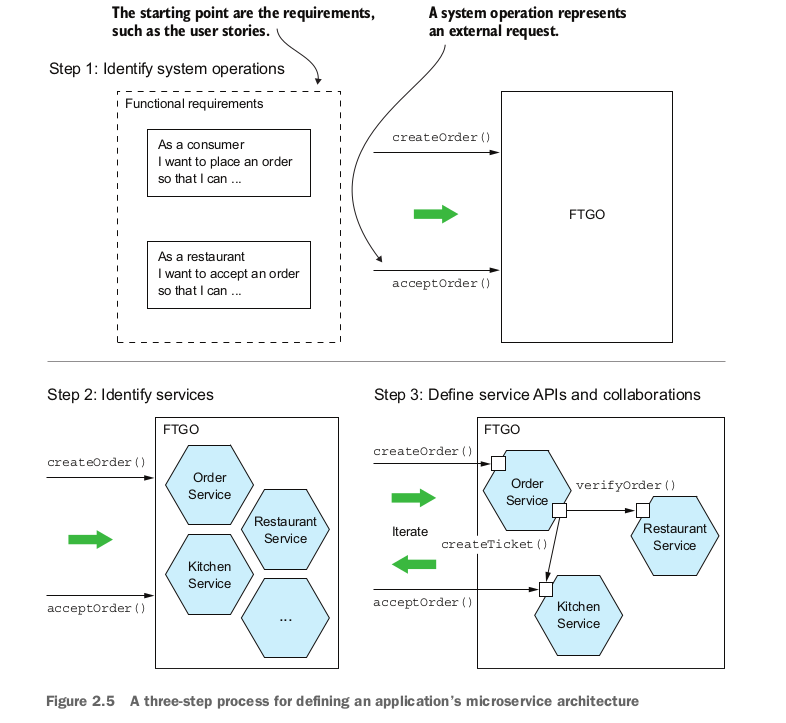

<div dir="rtl" style="font-size:60px; color:yellow">
فصل دوم
</div>

<br/>
<div dir="rtl" style="font-size:28px;  color:yellow">
Decomposition strategies
</div>

<br/>

<div dir="rtl" style="font-size:28px">
تعریف معماری نرم‌افزار
</div>

<br/>

<div dir="rtl" style="font-size:28px">
معماری نرم‌افزار یک سیستم محاسباتی، مجموعه‌ای از ساختارهایی است که برای تحلیل سیستم نیاز است و شامل عناصر نرم‌افزار، روابط میان آن‌ها و ویژگی‌های هر دو می‌شود.
</div>

<br/>

<div dir="rtl" style="font-size:28px">
این تعریف به وضوح بسیار انتزاعی است. اما جوهره آن این است که معماری یک برنامه، تفکیک آن به اجزا (عناصر) و روابط (رابطه‌ها) میان این اجزا است. تفکیک به دلایل زیر اهمیت دارد:
<br/>
تقسیم کار و دانش: تفکیک امکان تقسیم کار و دانش را فراهم می‌آورد. این به چندین نفر (یا چندین تیم) با دانش‌های تخصصی مختلف این امکان را می‌دهد که به طور مؤثری بر روی یک برنامه کار کنند.
<br/>
تعریف تعامل اجزای نرم‌افزار: تفکیک مشخص می‌کند که چگونه اجزای نرم‌افزار با یکدیگر تعامل دارند.
</div>

<br/>


<div dir="rtl" style="font-size:28px">
WHY ARCHITECTURE MATTERS
</div>

<br/>

<div dir="rtl" style="font-size:28px">
یک نرم‌افزار دارای دو دسته نیازمندی است. دسته اول شامل نیازمندی‌های عملکردی است که مشخص می‌کند نرم‌افزار باید چه کاری انجام دهد. این نیازمندی‌ها معمولاً به شکل موارد استفاده یا داستان‌های کاربر بیان می‌شوند. معماری تأثیر چندانی بر نیازمندی‌های عملکردی ندارد. شما می‌توانید نیازمندی‌های عملکردی را با تقریباً هر معماری‌ای پیاده‌سازی کنید، حتی با یک معماری پیچیده و نامرتب.

اما معماری به این دلیل اهمیت دارد که به نرم‌افزار کمک می‌کند دسته دوم نیازمندی‌ها را برآورده کند: نیازمندی‌های کیفیت خدمات. این نیازمندی‌ها همچنین به عنوان ویژگی‌های کیفی یا همان -ilityها شناخته می‌شوند. نیازمندی‌های کیفیت خدمات شامل ویژگی‌های زمان اجرای نرم‌افزار مانند مقیاس‌پذیری و قابلیت اطمینان است. همچنین شامل ویژگی‌های مربوط به زمان توسعه مانند نگهداشت‌پذیری، قابلیت تست و قابلیت استقرار نیز می‌شود. معماری‌ای که برای نرم‌افزار خود انتخاب می‌کنید تعیین می‌کند که تا چه اندازه این نیازمندی‌های کیفی را برآورده خواهد کرد.
</div>

<br/>

<div dir="rtl" style="font-size:28px">
THE LAYERED ARCHITECTURAL STYLE
</div>

<br/>

<div dir="rtl" style="font-size:28px">
یک مثال کلاسیک از سبک‌های معماری، معماری لایه‌ای است. در این نوع معماری، عناصر نرم‌افزار به لایه‌های مختلف تقسیم می‌شوند. هر لایه مجموعه‌ای مشخص از وظایف را بر عهده دارد. همچنین، معماری لایه‌ای محدودیت‌هایی در مورد وابستگی بین لایه‌ها ایجاد می‌کند. به این صورت که یک لایه تنها می‌تواند به لایه بلافاصله پایین‌تر از خود (در صورت استفاده از لایه‌بندی سختگیرانه) یا به هر یک از لایه‌های پایین‌تر وابسته باشد.

</div>

<br/>

<div dir="rtl" style="font-size:28px">
معماری لایه‌ای یکی از رایج‌ترین الگوهای معماری نرم‌افزار است که به طور کلاسیک سه لایه‌ی اصلی دارد:
<br/>
لایه ارائه (Presentation Layer): که مسئولیت ارائه رابط کاربری یا APIهای خارجی را بر عهده دارد.
<br/>
لایه منطق تجاری (Business Logic Layer): که شامل منطق اصلی برنامه و فرآیندهای کسب و کار است.
<br/>
لایه پایداری (Persistence Layer): که برای تعامل با دیتابیس و مدیریت داده‌ها مورد استفاده قرار می‌گیرد.

</div>
<br/>


<div dir="rtl" style="font-size:28px">
اما این معماری مشکلات و معایب مهمی دارد:
<br/>
لایه ارائه تک‌لایه‌ای: این معماری به‌طور پیش‌فرض تصور می‌کند که یک برنامه فقط از یک سیستم یا رابط کاربری فراخوانی می‌شود، در حالی که ممکن است برنامه توسط چندین سیستم مختلف (مثل اپلیکیشن موبایل، وبسایت و...) استفاده شود.
<br/>
لایه پایداری تک‌لایه‌ای: مشابه لایه ارائه، این معماری به‌طور پیش‌فرض فرض می‌کند که برنامه فقط با یک دیتابیس در ارتباط است، در حالی که در واقع ممکن است برنامه با چندین دیتابیس یا منابع داده‌ای متفاوت ارتباط داشته باشد.
<br/>
وابستگی لایه منطق تجاری به لایه پایداری: در این معماری فرض می‌شود که منطق تجاری باید مستقیماً به لایه پایدارسازی وابسته باشد، که این وابستگی می‌تواند مشکل‌ساز شود. به طور مثال، وابستگی مستقیم منطق تجاری به پایگاه داده باعث می‌شود که تست کردن منطق تجاری بدون دیتابیس مشکل باشد. به‌عبارت دیگر، برای تست کردن لایه منطق تجاری، نیاز به وجود دیتابیس داریم که این امر بهینه نیست.
</div>

<br/>


<div dir="rtl" style="font-size:28px">
ABOUT THE HEXAGONAL ARCHITECTURE STYLE
</div>


<div dir="rtl" style="font-size:28px">
ساختار درختی این معماری:
</div>

```text
.
├── app/
│   ├── adapters/
│   │   ├── inbound/
│   │   │   ├── api/
│   │   │   │   ├── controllers/
│   │   │   │   ├── routers.py
│   │   ├── outbound/
│   │   │   ├── redis_repository.py
│   │   │   ├── clickhouse_repository.py
│   │   │   ├── mysql_repository.py
│   ├── core/
│   │   ├── models/
│   │   │   ├── product.py
│   │   ├── services/
│   │   │   ├── product_service.py
│   ├── ports/
│   │   ├── repository_interface.py
│   ├── config/
│   │   ├── settings.py
│   ├── main.py

```

<div dir="rtl" style="font-size:28px">
در این معماری لایه logic به عنوان اولویت قرار دارد و این لایه برای گرفتن اطلاعات از پورت ها و اداپتر ها استفاده میکند
<br/>
پورت های ورودی مسئول انتقال رکوئست به داخل این لایه هستند و این لایه برای اینکه بتواند اطلاعات رو از دیتابیس یا هر چیز دیگیری بگیرد از پورت های خروجی استفاده میکند
</div>


<div dir="rtl" style="font-size:28px">
THE SIZE OF A SERVICE IS MOSTLY UNIMPORTANT
</div>

<br/>

<div dir="rtl" style="font-size:28px">
معماری میکروسرویس‌ها، برنامه را به مجموعه‌ای از سرویس‌های کوچک و به‌طور ضعیف وابسته سازماندهی می‌کند. نتیجه این است که زمان توسعه را بهبود می‌بخشد—قابلیت نگهداری، تست‌پذیری، قابلیت استقرار و غیره—و به سازمان‌ها کمک می‌کند تا نرم‌افزار بهتری را سریع‌تر توسعه دهند. همچنین مقیاس‌پذیری برنامه را بهبود می‌بخشد، هرچند که این هدف اصلی نیست. برای توسعه معماری میکروسرویس‌ها برای برنامه خود، باید سرویس‌ها را شناسایی کنید و تعیین کنید که چگونه با یکدیگر همکاری می‌کنند. بیایید بررسی کنیم که چگونه این کار را انجام دهیم.
</div>


<div dir="rtl" style="font-size:28px">
Defining an application’s microservice architecture
</div>

<br/>

<div dir="rtl" style="font-size:28px">
در مرحله اول باید عملیات های سیستمی سرویس ها شناخته شود.عملیات سیستم انتزاعی از یک درخواست است که برنامه باید آن را مدیریت کند. این عملیات می‌تواند یک فرمان (Command) باشد که داده‌ها را به‌روزرسانی می‌کند یا یک پرس‌وجو (Query) که داده‌ها را بازیابی می‌کند. 
<br/>
گام دوم در فرآیند تعریف معماری، تعیین تجزیه به سرویس‌ها است.

برای این کار، استراتژی‌های مختلفی وجود دارد. یکی از استراتژی‌ها، که ریشه در معماری کسب‌وکار دارد، تعریف سرویس‌ها بر اساس قابلیت‌های کسب‌وکار است. استراتژی دیگر، سازماندهی سرویس‌ها بر اساس زیردامنه‌های طراحی مبتنی بر دامنه (Domain-Driven Design) است
<br/>
گام سوم در تعریف معماری برنامه، تعیین API هر سرویس است. برای انجام این کار، هر عملیات سیستمی که در گام اول شناسایی شده را به یک سرویس اختصاص می‌دهید. یک سرویس ممکن است یک عملیات را به‌طور کامل پیاده‌سازی کند. از طرف دیگر، ممکن است نیاز به همکاری با سرویس‌های دیگر داشته باشد.
</div>



<br/>

<div dir="rtl" style="font-size:28px">
Identifying the system operations
</div>

<div dir="rtl" style="font-size:28px">
در مرحله اول، مدل دامنه سطح بالا ایجاد می‌شود که شامل کلاس‌های کلیدی است و یک واژگان برای توصیف عملیات‌های سیستم فراهم می‌کند. در مرحله دوم، عملیات‌های سیستم شناسایی شده و رفتار هر یک از آن‌ها با توجه به مدل دامنه توصیف می‌شود
</div>


<div dir="rtl" style="font-size:28px">
CREATING A HIGH-LEVEL DOMAIN MODEL
</div>

<div dir="rtl" style="font-size:28px">
اولین قدم در فرآیند تعریف عملیات سیستم، ترسیم یک مدل دامنه سطح بالا برای برنامه است. یک مدل دامنه با استفاده از تکنیک‌های استاندارد مانند تحلیل اسامی در داستان‌ها و سناریوها و صحبت با کارشناسان دامنه ایجاد می‌شود. به عنوان مثال، داستان "سفارش دادن" را در نظر بگیرید. ما می‌توانیم آن داستان را به سناریوهای مختلف کاربری گسترش دهیم، از جمله این سناریو:
<br/>
سناریوی سفارش:

اگر یک مشتری و یک رستوران وجود داشته باشد و آدرس/زمان تحویل که توسط رستوران قابل خدمت باشد و مجموع سفارش با حداقل سفارش رستوران مطابقت داشته باشد،
وقتی مشتری سفارشی را برای رستوران ثبت کند،
کارت اعتباری مشتری تأیید می‌شود و سفارشی با وضعیت PENDING_ACCEPTANCE ایجاد می‌شود که به مشتری و رستوران مرتبط است.
سناریوی پذیرش سفارش:

اگر سفارشی در وضعیت PENDING_ACCEPTANCE و پیکی در دسترس برای تحویل وجود داشته باشد و رستوران سفارشی را با وعده آماده‌سازی در زمان خاصی قبول کند،
وضعیت سفارش به ACCEPTED تغییر کرده و زمان وعده داده شده به‌روزرسانی می‌شود و پیک برای تحویل سفارش اختصاص داده می‌شود.
این سناریوها نشان‌دهنده وجود کلاس‌هایی مانند Consumer، Order، Restaurant، CreditCard، Courier و Delivery است. نتیجه نهایی پس از چندین بار تحلیل، مدلی از دامنه خواهد بود که شامل این کلاس‌ها و دیگر کلاس‌ها مانند MenuItem و Address است.
</div>


<div dir="rtl" style="font-size:28px">
DEFINING SYSTEM OPERATIONS
</div>

<div dir="rtl" style="font-size:28px">
پس از تعریف مدل دامنه سطح بالا، گام بعدی شناسایی درخواست‌هایی است که برنامه باید مدیریت کند. در این مرحله، به جای تمرکز بر پروتکل‌های خاص، از مفهوم انتزاعی عملیات سیستم برای نمایندگی درخواست‌ها استفاده می‌کنیم. عملیات سیستم به دو نوع تقسیم می‌شود:
<br/>
دستورات (Commands): عملیات‌هایی که داده‌ها را ایجاد، به‌روزرسانی و حذف می‌کنند.
<br/>
پرس‌وجوها (Queries): عملیات‌هایی که داده‌ها را می‌خوانند.
<br/>
برای شناسایی دستورات سیستم، می‌توان به افعال در داستان‌های کاربری و سناریوها نگاه کرد. به عنوان مثال، داستان "سفارش دادن" نشان می‌دهد که سیستم باید عملیات ایجاد سفارش را داشته باشد. مشخصات هر دستور شامل پارامترها، مقدار بازگشتی و رفتار آن است که به شرایط پیشین و پسین وابسته است.
<br/>
علاوه بر دستورات، پیاده‌سازی پرس‌وجوها نیز ضروری است زیرا اطلاعات لازم برای رابط کاربری را فراهم می‌کنند. برای مثال، پرس‌وجوهایی مانند findAvailableRestaurants که رستوران‌های قابل تحویل را جستجو می‌کند، از اهمیت معماری بالایی برخوردارند.
<br/>
در نهایت، مدل دامنه و عملیات سیستم نحوه عملکرد برنامه را مشخص می‌کنند و به تعریف معماری برنامه کمک می‌کنند. بعد از تعریف عملیات سیستم، گام بعدی شناسایی خدمات برنامه است که معمولاً بر اساس قابلیت‌های کسب‌وکار سازمان‌دهی می‌شوند.

</div>


<div dir="rtl" style="font-size:28px">
به طور مثال برای یک سیستم فروشگاهی:
</div>

| **عملیات سیستم**      | **پارامترها**                                    | **مقدار بازگشتی**   | **پیش‌شرط‌ها**                                                          | **پس‌شرط‌ها**                                                   |
|-----------------------|--------------------------------------------------|---------------------|-------------------------------------------------------------------------|-----------------------------------------------------------------|
| **AddProduct**        | نام محصول، توضیحات، قیمت، تعداد موجودی          | شناسه محصول         | - نام محصول باید منحصر به فرد باشد.<br>- قیمت و تعداد باید غیر منفی باشد. | - محصول جدید به سیستم اضافه می‌شود.<br>- شناسه محصول بازگردانده می‌شود. |
| **UpdateInventory**   | شناسه محصول، تعداد جدید موجودی                 | موفقیت یا شکست      | - شناسه محصول باید معتبر باشد.<br>- تعداد جدید باید غیر منفی باشد.      | - موجودی محصول به‌روز می‌شود.                                    |
| **CreatePurchaseOrder**| شناسه تأمین‌کننده، فهرست محصولات و مقادیر مورد نیاز | شناسه سفارش خرید   | - تأمین‌کننده باید معتبر باشد.<br>- محصولات باید در فهرست موجود باشند.<br>- مقادیر باید صحیح و غیر منفی باشند. | - سفارش خرید جدید ایجاد می‌شود.<br>- شناسه سفارش خرید بازگردانده می‌شود. |
| **ReceiveOrder**      | شناسه سفارش خرید، تاریخ دریافت، تعداد واقعی محصولات | موفقیت یا شکست      | - شناسه سفارش خرید باید معتبر باشد.<br>- تعداد محصولات دریافتی باید مطابق با سفارش باشد. | - موجودی محصولات به‌روزرسانی می‌شود.<br>- وضعیت سفارش خرید به "دریافت شده" تغییر می‌کند. |

<div dir="rtl" style="font-size:28px">
دیاگرام مدل دامنه
</div>

```
+------------------+          +------------------+
|    Product       |          |   Supplier       |
+------------------+          +------------------+
| - id             |          | - id             |
| - name           |          | - name           |
| - description    |          | - contact        |
| - price          |          | - address        |
| - stockQuantity  |          +------------------+
+------------------+                   |
           |                            |
           |                            |
           |                            |
           v                            v
+------------------+          +------------------+
|   Inventory      |          |   PurchaseOrder  |
+------------------+          +------------------+
| - productId      |          | - id             |
| - quantity       |          | - supplierId     |
| - lastUpdate     |          | - orderDate      |
+------------------+          | - status         |
                              +------------------+
                                          |
                                          |
                                          v
                               +------------------+
                               |    Order         |
                               +------------------+
                               | - id             |
                               | - date           |
                               | - status         |
                               | - totalAmount    |
                               +------------------+
```

<div dir="rtl" style="font-size:28px">
<br/>
- **Product**: نمایانگر محصولات فروشگاه.
<br/>
- **Inventory**: اطلاعات موجودی محصولات.
<br/>
- **Supplier**: اطلاعات تأمین‌کنندگان محصولات.
<br/>
- **PurchaseOrder**: نمایانگر سفارشات خرید از تأمین‌کنندگان.
<br/>
- **Order**: نمایانگر سفارشات ثبت شده در سیستم.
</div>

<br/>


<div dir="rtl" style="font-size:28px">
Defining services by applying the Decompose by business
capability pattern
</div>


<div dir="rtl" style="font-size:28px">
باید در این مرحله قابلیت های تجاری رو از مرحله قبل دربیاری و بر اساس اون ها تعریف کنی که چه سرویس هایی میخوای به طور مثال:
</div>

| **قابلیت تجاری**           | **عملیات‌ها**                | **سرویس‌ها**               | **توضیحات**                                                                 |
|----------------------------|------------------------------|----------------------------|------------------------------------------------------------------------------|
| **مدیریت محصولات**        | AddProduct, UpdateInventory  | **خدمت مدیریت محصولات**   | این خدمت مسئول اضافه کردن محصولات جدید و به‌روزرسانی موجودی محصولات است.      |
| **مدیریت سفارشات خرید**    | CreatePurchaseOrder, ReceiveOrder | **خدمت مدیریت سفارشات خرید** | این خدمت مسئول ایجاد و دریافت سفارشات خرید و به‌روزرسانی وضعیت آن‌ها است.      |


<br/>

<br/>

<div dir="rtl" style="font-size:28px">
 در اینجا جدول مربوط به تعریف خدمات با استفاده از الگوی تجزیه به زیر-دامنه برای سیستم فروشگاهی ارائه شده است:

</div>

| **زیر-دامنه**         | **دامنه**                                      | **عملیات‌ها**                                | **سرویس**            | **توضیحات**                                                                                  |
|-----------------------|------------------------------------------------|---------------------------------------------|----------------------|----------------------------------------------------------------------------------------------|
| **مدیریت محصولات**   | اطلاعات محصولات و موجودی                     | AddProduct (اضافه کردن محصول جدید) <br> UpdateInventory (به‌روزرسانی موجودی) | **Product Service** | مسئول اضافه کردن محصولات جدید و به‌روزرسانی موجودی‌ها.                                     |
| **مدیریت سفارشات**    | ایجاد و پیگیری سفارشات                        | CreatePurchaseOrder (ایجاد سفارش خرید) <br> ReceiveOrder (دریافت و پردازش سفارشات) | **Order Service**    | مسئول ایجاد و دریافت سفارشات و به‌روزرسانی وضعیت آن‌ها.                                   |
| **مدیریت مشتریان**    | مدیریت اطلاعات مشتریان و تعاملات آن‌ها       | ثبت‌نام مشتری، مدیریت پروفایل              | **Customer Service** | مسئول مدیریت اطلاعات مشتریان و تعاملات آن‌ها.                                             |
| **مدیریت تأمین‌کنندگان** | اطلاعات تأمین‌کنندگان و ارتباطات آن‌ها       | افزودن تأمین‌کننده جدید، به‌روزرسانی اطلاعات تأمین‌کننده | **Supplier Service** | مسئول مدیریت و ارتباط با تأمین‌کنندگان.                                                   |

<div dir="rtl" style="font-size:28px">
این جدول به شما کمک می‌کند تا زیر-دامنه‌های مختلف سیستم فروشگاهی را به صورت ساختاریافته مشاهده کنید و رابطه بین دامنه‌ها، عملیات‌ها و سرویس‌های مربوطه را بررسی کنید.

</div>

<br/>

<div dir="rtl" style="font-size:28px">

DETERMINING THE API S REQUIRED TO SUPPORT COLLABORATION BETWEEN SERVICES
</div>

<br/>

<div dir="rtl" style="font-size:28px">
در تعیین API سرویس‌ها، مراحل اصلی به این شکل هستند:
<br/>
تخصیص عملیات‌های سیستم به سرویس‌ها: هر عملیات سیستم به سرویسی اختصاص داده می‌شود که به اطلاعات آن نیاز دارد یا مسئول اجرای آن است.
<br/>
همکاری بین سرویس‌ها: برخی عملیات‌ها تنها توسط یک سرویس اجرا می‌شوند، اما بسیاری از عملیات‌ها نیازمند همکاری چندین سرویس هستند. برای این منظور، هر سرویسی باید API‌های لازم را برای همکاری با سرویس‌های دیگر فراهم کند.
<br/>
نقش پیام‌رسانی ناهمزمان: برخی سرویس‌ها ممکن است به جای فراخوانی همزمان سرویس‌های دیگر، از پیام‌رسانی ناهمزمان برای کاهش وابستگی و افزایش استقلال استفاده کنند.
<br/>

نتیجه:
<br/>
در نهایت، هر API بر اساس نیازمندی‌های سرویس‌ها و نوع همکاری بین آنها طراحی می‌شود، تا سرویس‌ها بتوانند عملیات‌های پیچیده را به‌درستی اجرا کنند.

</div>


