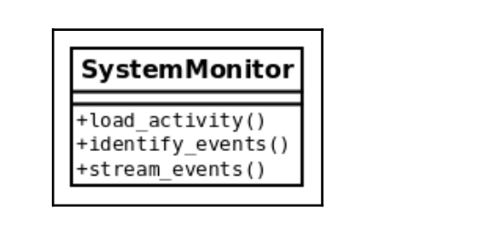
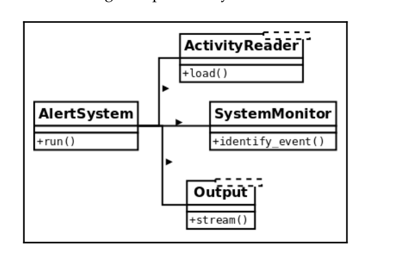

<div dir="rtl" style="font-size:48px; text-align: justify">
clean code in python
</div>


<div dir="rtl" style="font-size:28px; text-align: justify">
استفاده از Annotations
</div>

<div dir="rtl" style="font-size:18px; text-align: justify">
برای پایتون های قدیمی که همان pep3107 است
</div>

```python
x: int = 0 
y: list = []
```

<div dir="rtl" style="font-size:18px; text-align: justify">
برای پایتون های جدید همان pep484 است
</div>

```python
from typing import List

y: List[str] = []
```

<div dir="rtl" style="font-size:18px; text-align: justify">
میتوانیم مقدار آن را تعریف نکنیم
</div>

```python
from typing import List

y: List[str]
```

<div dir="rtl" style="font-size:28px; text-align: justify">
استفاده از Doc String در کدها:
</div>

<div dir="rtl" style="font-size:18px; text-align: justify">
سعی کنم که توضیح مختصری از نحوه ی عملکرد تابع ارایه بدم و همچنین نوع خروجی و ورودی را در آن مشخص کنم
</div>

```python
def data_from_response(response: dict) -> dict:
    """If the response is OK, return its payload.
    - response: A dict like::
    {
    "status": 200, # <int>
    "timestamp": "....", # ISO format string of the current
    date time
    "payload": { ... } # dict with the returned data
    }
    - Returns a dictionary like::
    {"data": { .. } }
    - Raises:
    - ValueError if the HTTP status is != 200
    """
    if response["status"] != 200:
        raise ValueError
    return {"data": response["payload"]}
   ```

<div dir="rtl" style="font-size:18px; text-align: justify">
طبق pep343 بهتره برای خواندن از فایل یا مدیریت خطا از `with` استفاده کنیم
</div>

```python
with open("filename.txt") as fd:
    fd.write("something")
```

<div dir="rtl" style="font-size:18px; text-align: justify">
عبارت with مثل یک کلاس عمل میکنه که متد های exit , enter رو پیاده سازی کرده.
اگر خطا بخوره میره تو exit

یا وقتی تموم شه اینتر میره به exit
</div>

```python
import contextlib

class DBHandlerDecorator(contextlib.ContextDecorator):
    def __enter__(self):
        self.stop_database()
        
    def __exit__(self, ext_type, ex_value, ex_traceback):
        self.start_database()
    
    def stop_database(self):
        pass
    
    def start_database(self):
        pass
    
    
@DBHandlerDecorator()
def offline_backup():
    # run("pg_dump database")
    return True
```

<div dir="rtl" style="font-size:18px; text-align: justify">
روش دیگر استفاده از تابع:
</div>

```python
import contextlib

def stop_database():
    pass

def start_database():
    pass

def db_backup():
    pass

@contextlib.contextmanager
def db_handler():
    stop_database()
    yield
    start_database()
    
    
with db_handler():
    db_backup()
```

<div dir="rtl" style="font-size:18px; text-align: justify">
گاهی اوقات میخوایم مدیریت خطا را انجام بدیم و وقتی خطا خورد هیچ کاری نکنه یعنی در قسمت except آن مقدار pass باشه. روش بهتر:
</div>

```python
import contextlib

class DataConversionException(Exception):
    pass

def parse_data():
    pass

with contextlib.suppress(DataConversionException):
    parse_data()
```

<div dir="rtl" style="font-size:18px; text-align: justify">
حتما شرایط پیشازی (precondition) و شرایط پسازی (postcondition) در کد رعایت شود. یعنی حتما چک بشه که type ورودی ها چیه و همچنین نوع خروجی آیا با اون شرایطی که میخوایم مطابقت داره یا نه.
</div>


<div dir="rtl" style="font-size:18px; text-align: justify">
برای این کار روش های مختلفی وجود داره که بهترین آن ها استفاده از دکوریتور است. به این صورت که یک دکوریتور مینویسیم و بالای توابع صدا میزنیم و اون شرطی که میخوایم به این دکوریتور میدهیم.
</div>

<div dir="rtl" style="font-size:18px; text-align: justify">
البته روش بهتر این است که ما برای تابع یک DocString بنویسیم و در دکوریتور این DocString را رعایت کنیم و ورودی و خروجی تابع را با آن مقایسه کنیم.
</div>

```python
def add_to_select_query(query, field):
    """
    Add a field to a select query in SQLAlchemy object.

    :param query: A SQLAlchemy query object created up to this point.
    :param field: A SQLAlchemy object or a string.
                  This parameter can be a string like `tracker_token`
                  or a SQLAlchemy object like `func.count(func.case([(ClickHouseTable.doc_type == 3, 1)]))`

    PreConditions:
        :type query: Select
        :type field: Union[str, Column, func]

    PostConditions:
        :rtype: Select

    :return: A SQLAlchemy object that adds a new field to the select query.
    """
    pass
```

<div dir="rtl" style="font-size:18px; text-align: justify">
رعایت شرایط پیشازی و پسازی مربوط میشه به Design By Contract یا (DBC) که در مقابل برنامه نویسی دفاعی است.
</div>

<div dir="rtl" style="font-size:18px; text-align: justify">
در برنامه نویسی دفاعی از assert استفاده میشود. یعنی تا زمانی که به این خط نرسیده برنامه اجرا میشه
</div>

```python
def calcute_average(numbers):
    assert isinstance(numbers, list)
    assert len(numbers) > 0
```

<div dir="rtl" style="font-size:18px; text-align: justify">
طبق pep3134 بهتره که متن خطا رو به همراه خود خطا پرتاب کنیم با استفاده از: 
</div>

```python
class InternalDataError(Exception):
    pass
        
raise InternalDataError.__name__ from e
```


<div dir="rtl" style="font-size:18px; text-align: justify">
سعی کنیم وظایفی که به یک تابع میدیم فقط ۱ وظیفه باشه هم تعداد پارامترها کاهش پیدا میکنه هم خوانایی کد افزایش پیدا میکنه
</div>

<div dir="rtl" style="font-size:28px; text-align: justify">
DRY
</div>

<div dir="rtl" style="font-size:18px; text-align: justify">
DRY (Don't Repeat Yourself - تکرار نکن): این اصل بیان می‌کند که در کد نباید اطلاعات و عملکردهای مشابه را تا حد امکان تکرار کنیم. به جای آن، باید اطلاعات و عملکردهای مشترک را در یک مکان مشخص تعریف کرده و از آن‌ها در تمام نقاط کد استفاده کنیم. این کار باعث افزایش قابلیت تغییر و نگهداری کد می‌شود و از خطاهای تکراری جلوگیری می‌کند.
</div>

<div dir="rtl" style="font-size:28px; text-align: justify">
OAOO
</div>

<div dir="rtl" style="font-size:18px; text-align: justify">
این OAOO (Once and Only Once - یک‌بار و فقط یک‌بار): این اصل مرتبط با تکرار نکردن دانش و قوانین در کد است. به این معناست که هر عملکرد و قانون باید تنها یک‌بار و در یک مکان مشخص در کد تعریف شود. این اصل به کاهش تکرار دانش و افزایش یکپارچگی کد کمک می‌کند.

در مجموع، این اصول بهترین عملکرد و نگهداری کد را تضمین می‌کنند و کمک می‌کنند تا کد شما ساده‌تر، قابل فهم‌تر و قابل تغییرتر باشد.</div>

<div dir="rtl" style="font-size:28px; text-align: justify">
YAGNI
</div>

<div dir="rtl" style="font-size:18px; text-align: justify">
اصل YAGNI به معنای "شما به آن نیاز نخواهید داشت" است. این اصل به توسعه نرم‌افزارها آموزش می‌دهد که بدون اضافه کردن قابلیت‌ها یا کدهای اضافی که فعلاً نیازی به آنها نیست، کار کنند. یعنی وقتی نیازهای آینده را پیش‌بینی کرده و کدهای پیچیده و اضافی ایجاد نکنید.
</div>

<div dir="rtl" style="font-size:28px; text-align: justify">
KISS
</div>

<div dir="rtl" style="font-size:18px; text-align: justify">
اصل KIS به معنای "ساده باشد که بشود" یا به اصطلاح Keep It Simple, Stupid است. این اصل به توسعه نرم‌افزارها و طراحی کدها آموزش می‌دهد که به قدر لازم و به حداقل بسنده کنند و از پیچیدگی‌های غیرضروری پرهیز کنند.

به عبارت دیگر، این اصل تاکید دارد که برنامه‌نویسان باید کد خود را به سادگی و کم‌پیچیدگی طراحی کنند و از ایجاد راه‌حل‌های پیچیده و اضافی که نیازی به آنها نیست، پرهیز کنند. ساده‌سازی کد به افزایش خوانایی، نگهداری آسان‌تر، و کاهش احتمال وقوع اشتباه‌ها کمک می‌کند.
</div>


<div dir="rtl" style="font-size:28px; text-align: justify">
اصول SOLID
</div>

<div dir="rtl" style="font-size:18px; text-align: justify">
S: Single responsibility principle
</div>

<div dir="rtl" style="font-size:18px; text-align: justify">
O: Open/closed principle
</div>

<div dir="rtl" style="font-size:18px; text-align: justify">
L: Liskov's substitution principle
</div>

<div dir="rtl" style="font-size:18px; text-align: justify">
I: Interface segregation principle
</div>

<div dir="rtl" style="font-size:18px; text-align: justify">
D: Dependency inversion principle
</div>

<div dir="rtl" style="font-size:28px; text-align: justify">
S
</div>

<div dir="rtl" style="font-size:18px; text-align: justify">
اصل مسئولیت تکی (SRP) در برنامه‌نویسی نرم‌افزار به این معنا است که هر کلاس یا مؤلفه نرم‌افزاری فقط مسئولیت یک کار خاص را باید داشته باشد و وظایف گوناگون را در خود جای ندهد. به عبارت دیگر، یک کلاس باید تنها یک دلیل برای تغییر داشته باشد. اگر یک کلاس وظایف متعددی داشته باشد، تغییر در هر کدام از این وظایف ممکن است تغییر در سایر بخش‌های کد را نیز به همراه داشته باشد و این موجب افزایش پیچیدگی و سختی نگهداری شود.
به عنوان مثال یک کلاس که شامل توابعی که کارهای مختلفی انجام میدهد.
</div>

</img>

<div dir="rtl" style="font-size:18px; text-align: justify">
طبق این قانون باید به این تبدیل بشه:
</div>

</img>

<div dir="rtl" style="font-size:28px; text-align: justify">
O
</div>

<div dir="rtl" style="font-size:18px; text-align: justify">
 اصل Open/Closed (OCP) به معنای این است که برنامه‌ها و کلاس‌ها باید قابلیت توسعه را داشته باشند (باز باشند) برای پذیرش تغییرات جدید در نیازها یا ویژگی‌های جدید، اما نباید نیاز به تغییر در کدهای موجود داشته باشند (بسته باشند).

به عبارت ساده‌تر، اگر چیزی جدید باید به یک کلاس یا ماژول اضافه شود، ما نباید کد موجود را تغییر دهیم؛ بلکه باید تنها کدهای جدید را اضافه کنیم تا به نیازهای جدید پاسخ دهیم.
به طور مثال کد پایین بده:
</div>

```python
class Plant:
    def __init__(self, name, type):
        self.name = name
        self.type = type

class Garden:
    def __init__(self):
        self.plants = []
        
def add_plant(self, plant):
    self.plants.append(plant)

def calculate_total_water(self):
    total_water = 0
    for plant in self.plants:
        if plant.type == "Tree":
            total_water += 10
        elif plant.type == "Flower":
            total_water += 5
        elif plant.type == "Shrub":
            total_water += 7
    return total_water
```

<div dir="rtl" style="font-size:18px; text-align: justify">
ریفکتور کد بالا:
</div>

```python
from abc import ABC, abstractmethod

class Plant(ABC):
    def __init__(self, name):
        self.name = name

    @abstractmethod
    def get_water_requirement(self):
        pass

class Tree(Plant):
    def get_water_requirement(self):
        return 10

class Flower(Plant):
    def get_water_requirement(self):
        return 5

class Shrub(Plant):
    def get_water_requirement(self):
        return 7

class Garden:
    def __init__(self):
        self.plants = []

    def add_plant(self, plant):
        self.plants.append(plant)

    def calculate_total_water(self):
        total_water = 0
        for plant in self.plants:
            total_water += plant.get_water_requirement()
        return total_water
```

<div dir="rtl" style="font-size:28px; text-align: justify">
L
</div>

<div dir="rtl" style="font-size:18px; text-align: justify">
اصل L: به طور کلی، در اصل جایگزینی لیسکوف، اهمیت اصلی این است که تمام شیء‌های نوع زیرنوع باید به طور سازگار با کلاس پایه عمل کنند، اما می‌توانند ویژگی‌های اضافی داشته باشند که توسعه و تفاوت‌های خودشان را دارند.
</div>

```python
class Chocolate:
    def __init__(self,name, cocoa_content):
        self.name = name
        self.cocoa_content = cocoa_content

class DarkChocolate(Chocolate):
    def __init__(self, name, cocoa_content):
        super().__init__(name, cocoa_content)
        self.type = "Dark Chocolate"

class MilkChocolate(Chocolate):
    def __init__(self, name, cocoa_content):
        super().__init__(name, cocoa_content)
        self.type = "Milk Chocolate"
```

<div dir="rtl" style="font-size:28px; text-align: justify">
I
</div>

<div dir="rtl" style="font-size:18px; text-align: justify">
 کلاس ها باید از یک کلاس انتزاعی ارث برده باشند تا مجبور به پیاده سازی متدهای لازم باشند.و کلاس ها متدهایی رو پیاده سازی کنن که واقعا به اون ها نیاز دارند.
</div>

<div dir="rtl" style="font-size:28px; text-align: justify">
D
</div>

<div dir="rtl" style="font-size:18px; text-align: justify">
میگه که برنامه من باید به interface وابسته باشه نه به کلاس های مشتق شده ی اون 
</div>

```python
from abc import ABC, abstractmethod

class InfoProvider(ABC):
    @abstractmethod
    def get_info(self):
        pass

class DataService(InfoProvider):
    def get_info(self):
        return "Data from DataService"

class FileService(InfoProvider):
    def get_info(self):
        return "Data from FileService"

class MessageProcessor:
    def __init__(self, info_provider: InfoProvider):
        self.info_provider = info_provider

    def process_info(self):
        info = self.info_provider.get_info()
        # Process the info here
```

<div dir="rtl" style="font-size:18px; text-align: justify">
در مثال بالا یک اینترفیس InfoProvider نوشته شده است و دو کلاس DataService و FileService از این اینترفیس استفاده کردن که کارهای مربوط به خودشون رو انجام میدن. و در کلاس اصلی MessageProcessor این کلاس به انترفیس وابسته هست نه به اون کلاس های مشتق شده از اون 
</div>

<div dir="rtl" style="font-size:28px; text-align: justify">
استفاده از دکوریتورها
</div>

<div dir="rtl" style="font-size:18px; text-align: justify">
بتوانیم از دکوریتورها برای توابع استفاده کنیم تا منطق های مختلفی را به آن ها اعمال کنیم. مثلا پارامترها را تایید کنیم، شرایط اولیه را بررسی کنیم، رفتار را تغییر دهیم، امصای آن را تغییر دهیم و ...
</div>

<div dir="rtl" style="font-size:18px; text-align: justify">
در موارد زیر بهتره از دکوریتور استفاده بشه:
۱- احراز هویت و دسترسی: کنترل دسترسی به منابع
۲- لاگ گیری: لاگ کردن عملکرد تابع و متدها
۳- کشینگ: نتایج محاسبات را کش کنیم
۴- مدیریت تراکنش ها
۵- زمان بندی: برای اجرای یک تابع در یک بازه زمانی معین
۶- برای retrying: نیاز به تلاش های مجدد
۷- نظارت و تجزیه و تحلیل
</div>

<div dir="rtl" style="font-size:18px; text-align: justify">
ترتیب اجرای دکوریتور ها از بالا به پایین است
</div>

<div dir="rtl" style="font-size:18px; text-align: justify">
اگر نیاز به یک دکوریتور ساده دارم که تنها یک عملکرد را به تابع اصلی اضافه کند استفاده از تابع برای ساخت دکوریتور مناسبتر است. اما اگر نیاز به دکوریتوری داری که ویژگی های بیشتری مثل پارامتر های پیچیده یا مدیریت وضعیت داشته باشند، استفاده از کلاس مناسب تر است.
</div>

```python
class CheckTaskStatus:
    def __init__(self, minimum_a: int = 2):
        self.minimum_a = minimum_a
    
    def __call__(self, func):
        def wrapper(task_list: list):
            complate_list: list = [
                task for task in task_list
            ]
            
            if len(complate_list) >= self.minimum_a:
                func(task_list)
        return wrapper
```

<div dir="rtl" style="font-size:28px; text-align: justify">
توصیف کننده ها
</div>

<div dir="rtl" style="font-size:18px; text-align: justify">
یک شی است که نمونه ای از یک کلاس است که پروتکل ویژگی توصیفی را پیاده سازی میکند که شامل متدهای زیر است:
</div>

`
__get__, __set__, __delete__, __set_name__
`

<div dir="rtl" style="font-size:23px; text-align: justify">
انواع توصیف کننده ها:
</div>

<div dir="rtl" style="font-size:18px; text-align: justify">
Data Descriptor
</div>

<div dir="rtl" style="font-size:18px; text-align: justify">
این نوع ویژگی توصیفی توابع __set__ و __delete__ را پیاده سازی میکنند و میتوانند مقدار جدید به آن اختصاص داده یا مقدار موجود در آن را حذف کنند
</div>

<div dir="rtl" style="font-size:18px; text-align: justify">
None Data Descriptor
</div>

<div dir="rtl" style="font-size:18px; text-align: justify">
این ویژگی تابع __get__ را پیاده سازی میکنند.
</div>

```python
class HistoryTracedAttribute:
    def __init__(self, trace_attribute_name) -> None:
        self.trace_attribute_name = trace_attribute_name
        self._name = None

    def __set_name__(self, owner, name):
        self._name = name

    def __get__(self, instance, owner):
        if instance is None:
            return self
        return instance.__dict__[self._name]

    def __set__(self, instance, value):
        self._track_change_in_value_for_instance(instance, value)
        instance.__dict__[self._name] = value

    def _track_change_in_value_for_instance(self, instance, value):
        self._set_default(instance)

        if self._needs_to_track_change(instance, value):
            instance.__dict__[self.trace_attribute_name].append(value)

    def _needs_to_track_change(self, instance, value) -> bool:
        try:
            current_value = instance.__dict__[self._name]
        except KeyError:
            return True
        return value != current_value

    def _set_default(self, instance):
        instance.__dict__.setdefault(self.trace_attribute_name, [])

class Traveller:
    current_city = HistoryTracedAttribute("cities_visited")

    def __init__(self, name, current_city):
        self.name = name
        self.current_city = current_city
```

<div dir="rtl" style="font-size:18px; text-align: justify">
همون طور که دیدید در اینجا زیاد از حد از dict استفاده شده برای اینکه از این استفاده نکنیم میتوانیم از کتابخونه weak استفاده کردیم
</div>

```python
from weakref import WeakKeyDictionary

class DescriptorClass:
    def __init__(self, initial_value):
        self.value = initial_value
        self.mapping = WeakKeyDictionary()

    def __get__(self, instance, owner):
        if instance is None:
            return self
        return self.mapping.get(instance, self.value)

    def __set__(self, instance, value):
        self.mapping[instance] = value
```

